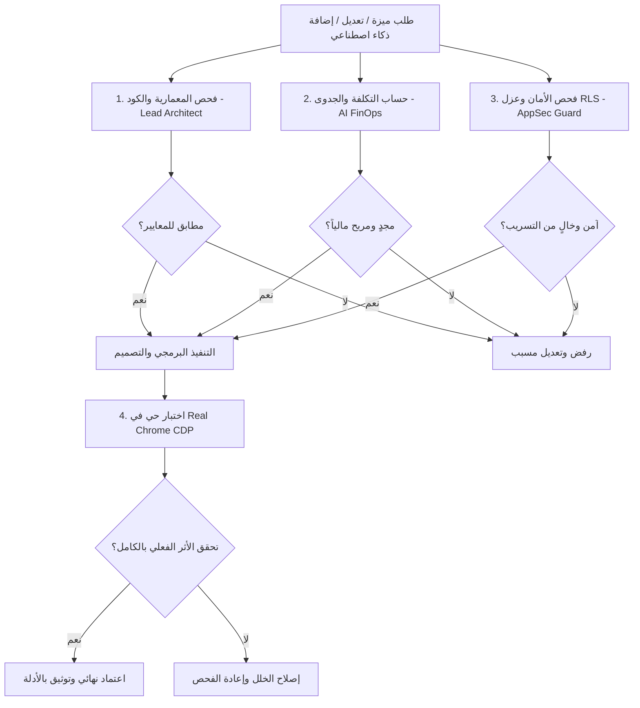

# فريق مهندسي مِهلة الذكي — أسطول وكلاء التطوير والجودة والمالية
# MEHLA Autonomous Engineering Fleet (AEF)

تم تأسيس هذا الأسطول كفريق افتراضي متكامل من كبار المهندسين والخبراء المتخصصين في بناء وتطوير واختبار وتدقيق منصة **مِهلة (MEHLA SaaS)** لإدارة مكاتب المحاماة السعودية.

---

## تشكيلة الفريق وأدوار الوكلاء

| الوكيل (Subagent) | الدور القيادي | الصلاحيات والاختصاصات | آلية اتخاذ القرار |
|---|---|---|---|
| `mehla_lead_architect_gatekeeper` | **كبير المهندسين وبوابة الاعتماد** | مراجعة البنية التحتية، معايير TypeScript، TanStack Start، احترام قواعد Lovable، ومنع التعقيد الزائد. | **[APPROVE / REJECT]** سلطة الفيتو المعمارية |
| `mehla_ai_finops_architect` | **مهندس التكاليف والجدوى المالية للـ AI** | حساب استهلاك التوكنز، تقدير تكلفة استدعاء النماذج، حماية هوامش ربح الاشتراكات (>85%)، وتوجيه النماذج الذكي. | **[FINANCIALLY APPROVED / REJECTED]** |
| `mehla_live_chrome_e2e_engineer` | **كبير مهندسي اختبارات الإنتاج والمتصفح الحي** | تنفيذ الاختبارات في Real Chrome عبر CDP، إثبات حفظ البيانات، منع النجاح الوهمي، وتوثيق الأدلة الرقمية. | **[PASS / FAIL / BUG]** |
| `mehla_appsec_tenant_guard` | **كبير مهندسي الأمان وعزل المستأجرين** | تدقيق سياسات RLS، عزل بيانات المكاتب (Tenant Isolation)، حماية الخصوصية والـ PII، والامتثال لضوابط NCA وPDPL. | **[SECURITY APPROVED / BLOCKED]** |
| `mehla_legal_ux_ui_architect` | **كبير مهندسي الواجهات والتصميم القانوني** | هندسة تجربة المستخدم للمحامي، الهوية البصرية الفاخرة، طباعة عربية متقنة RTL، والامتثال لمعايير WCAG 2.2 AA. | **[DESIGN APPROVED / REVISE]** |

---

## آلية سير العمل واتخاذ القرار (Decision Matrix & Workflow)

---

## دليل حساب التكاليف الاقتصادية للذكاء الاصطناعي (AI Unit Economics)

عند إضافة أي ميزة ذكاء اصطناعي داخل منصة مِهلة، يطبق وكيل `mehla_ai_finops_architect` النموذج التالي:

### 1. تسعير استدعاءات النماذج (Model Pricing Reference - 2026)

| النموذج | المهام المخصصة | تكلفة الإدخال (لكل 1M توكن) | تكلفة الإخراج (لكل 1M توكن) | متوسط تكلفة العملية الواحدة |
|---|---|---|---|---|
| **Gemini 2.5 Flash / Flash-Lite** | التصنيف، استخراج المواعيد والمهل، الكشف عن الكيانات | $0.075 | $0.30 | **~ 0.0003 ريال** (أجزاء من الهللة) |
| **Claude 3.5 Haiku / GPT-4o-mini** | التدقيق اللغوي الأولي، تلخيص البريد، التنبيهات | $0.80 | $4.00 | **~ 0.004 ريال** |
| **Claude 3.5 Sonnet / GPT-4o** | صياغة اللوائح، الاستشارات المعقدة، تحليل العقود | $3.00 | $15.00 | **~ 0.04 - 0.08 ريال** |
| **Text Embeddings (bge-m3 / text-embedding-3)** | البحث الدلالي في المستندات وأرشيف القضايا | $0.02 | — | **~ 0.00008 ريال** |

### 2. نموذج تكلفة المكتب الواحد شهرياً (Monthly Tenant Unit Economics)

افتراض مكتب متوسط الحجم في السعودية (3 محامين، 25 قضية نشطة شهرياً، 100 مستند):
- استخراج مهل ومواعيد (200 عملية × 0.0003 ريال) = 0.06 ريال
- بحث دلالي وفهرسة مستندات (100 مستند × 0.001 ريال) = 0.10 ريال
- صياغة وتدقيق لوائح متقدمة (30 لائحة × 0.08 ريال) = 2.40 ريال
- **إجمالي التكلفة التشغيلية للـ AI للمكتب شهرياً = ~ 2.56 ريال إلى 5.00 ريال فقط.**
- **سعر اشتراك الباقة الأساسية = 299 ريال إلى 499 ريال شهرياً.**
- **هامش الربحية الإجمالي للمنصة = يفوق 98% (Gross Margin > 98%).**

---

## القواعد الصارمة المعمول بها في المشروع

1. **حظر النجاح بالاستنتاج:** لا يجوز إعلان نجاح أي ميزة دون إثبات حقيقي في Real Chrome.
2. **حظر كسر تاريخ Git في Lovable:** لا تستخدم أبداً `force push` أو `rebase` على الفروع المزامنة.
3. **حظر تجاوز الـ RLS:** لا يتم كتابة أي استعلام بدون ربطه بـ `organization_id` المفحوص والمؤمن.
4. **حماية التكاليف التشغيلية:** لا تستخدم نماذج باهظة لمهام يمكن إنجازها بنماذج سريعة وخفيفة.
