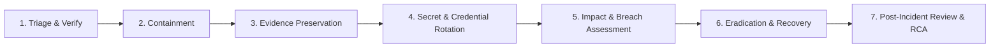

# MEHLA Security Incident Response & Forensic Triage Master Skill

## Purpose
Governs the detection, containment, investigation, evidence preservation, eradication, recovery, and regulatory reporting (Saudi PDPL 72-hour notification protocol) for security incidents on MEHLA.

## When To Use
- Suspected or confirmed leaked API key, database secret, or service role token.
- Suspected cross-tenant data leakage or unauthorized access attempt.
- Compromised administrative or user account.
- Malicious file upload or webhook forgery detected.
- Post-incident root cause analysis (RCA) and forensic review.

## The 7-Phase Incident Response Lifecycle



### Phase 1: Triage & Verification
- Verify the authenticity of the alert.
- Classify incident severity:
  - **SEV-1 (Critical)**: Active cross-tenant data leak, compromised `service_role` key, unauthenticated database access.
  - **SEV-2 (High)**: Compromised lawyer account, leaked integration token, unauthorized admin login.
  - **SEV-3 (Medium)**: Targeted DDoS / rate-limit exhaustion, isolated unverified vulnerability report.

### Phase 2: Immediate Containment
- Isolate affected components without destroying volatile evidence.
- Revoke compromised session tokens or suspend compromised user accounts.

### Phase 3: Evidence Preservation
- **NEVER delete log records or database rows during containment**.
- Export and cryptographically hash audit logs, network traces, and error payloads for forensic analysis.

### Phase 4: Credential & Secret Rotation
- Rotate affected secrets immediately via provider dashboards:
  - Supabase Database Password & Service Role Key
  - Resend API Keys / Hostinger Mail Passwords
  - WhatsLine & Mobile.net API Tokens
  - PII Encryption Master Key (re-encrypt affected records)

### Phase 5: Saudi Regulatory Assessment (PDPL 72h Protocol)
- Under Article 24 of the Saudi Personal Data Protection Law (PDPL):
  - Assess whether personal data of Saudi citizens was compromised.
  - If a breach occurred: Prepare formal notification payload for **SDAIA / Cert.sa** within **72 hours** of discovery.
  - Prepare client notification if breach poses a risk to their legal or financial rights.

### Phase 6: Eradication & Recovery
- Deploy patch to eliminate root-cause vulnerability.
- Verify through regression tests that the exploit vector is sealed.

### Phase 7: Post-Incident Review (PIR / RCA)
- Produce a blameless Root Cause Analysis (RCA) document detailing timeline, root cause, impact, lessons learned, and preventive action items.

## Output Format
```markdown
### 🚨 MEHLA Security Incident Response Report: [Incident Title]
- **Incident Reference**: [INC-YYYY-XXXX]
- **Severity**: [SEV-1 / SEV-2 / SEV-3]
- **Status**: [CONTAINED / RESOLVED]
- **PDPL 72h Notification Triggered**: [YES / NO / UNDER_ASSESSMENT]

#### 1. Timeline & Events
- `[UTC Time]`: Incident detected via alert.
- `[UTC Time]`: Containment executed; credentials rotated.

#### 2. Root Cause Analysis (RCA)
- **Root Cause**: [Detailed explanation]
- **Compromised Assets**: [List of affected records or tokens]

#### 3. Corrective & Preventive Actions (CAPA)
- [ ] Action item 1 (Assigned to: ...)
```

## Standards Baseline & References
- **NIST SP 800-61 Rev 2**: Computer Security Incident Handling Guide
- **Saudi PDPL (نظام حماية البيانات الشخصية)**: Article 24 (Breach Notification)
- **NCA Essential Cybersecurity Controls (ECC-1:2018)**: 5-1 Cybersecurity Incident Management
