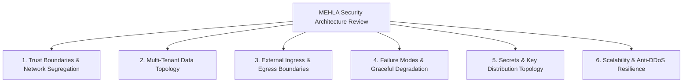

# MEHLA Security Architecture Review Master Skill

## Purpose
Evaluates macro-level system architecture, high-level structural designs, new subsystem blueprints, and cross-cutting cloud infrastructure integrations before implementation begins. Produces an authoritative architectural verdict: **`SECURITY ARCHITECTURE APPROVED`** or **`REQUIRES_CHANGES`**.

## When To Use
- Trigger with `review security architecture` or before implementing major architectural changes (e.g. Subdomain routing, Hybrid Storage BYOS, Najiz Extension integration, Cloud Migration to Saudi Orca Server).
- Reviewing major refactors that impact data storage, edge proxies, database topology, or third-party gateways.

## The 6 Architecture Review Dimensions



### 1. Trust Boundaries & Network Segregation
- Clear demarcation between untrusted clients (Browser/Mobile), edge proxies (Cloudflare/Nitro), application server (TanStack Start), managed database (Supabase PostgreSQL), and external SaaS integrations.

### 2. Multi-Tenant Data Topology
- Verification that new data models naturally partition by `organization_id` and do not create shared global state across law firms.

### 3. External Ingress & Egress Boundaries
- Ingress: Protected via edge WAF, rate limiters, and CSRF/CORS filters.
- Egress: Outbound HTTP calls filtered through the SSRF protection proxy (`src/lib/integrations/http.server.ts`).

### 4. Failure Modes & Graceful Degradation
- Ensure external integration failures (e.g. SMS provider down, WhatsApp API latency) do not crash the core application or corrupt financial transactions (Fail-Secure & Resilient Fallbacks).

### 5. Secrets & Key Distribution Topology
- Ensure secrets are retrieved from environment variables at runtime, never bundled or persisted in client-facing layers.

### 6. Scalability & Anti-DDoS Resilience
- Validate that compute-heavy operations (OCR processing, PDF generation, ZIP bundle downloads) are throttled and dispatched to background workers.

## Output Format
```markdown
### 🏛️ MEHLA Security Architecture Review Report: [Architecture Title]

#### 1. Architecture Summary & Scope
- **Subsystem**: [Description of architectural component]
- **Target Scale & Sensitivity**: [High-Sensitivity Multi-Tenant SaaS]

#### 2. Architecture Review Dimensions
- [x] Trust Boundaries: Defined & Isolated
- [x] Data Partitioning: Strict `organization_id` isolation
- [x] Ingress/Egress Controls: WAF + SSRF Shield active
- [x] Failure Mode: Fail-Secure with graceful fallback

#### 3. Architectural Verdict
# 🟢 VERDICT: SECURITY ARCHITECTURE APPROVED
> The proposed architecture satisfies all MEHLA security guardrails and tenant isolation requirements.
```

## Standards Baseline & References
- **NIST SP 800-218 SSDF**: PW.1 (Design Software to Meet Security Requirements)
- **OWASP SAMM v2.0**: Security Architecture Domain
- **MEHLA Technical Architecture**: `docs/technical-architecture.md`
