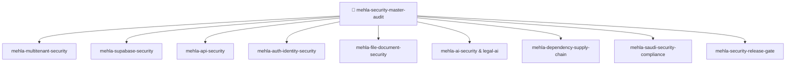

# MEHLA Master Security Audit Orchestrator Skill

## Purpose
Acts as the central Master Orchestrator for comprehensive security assessments across the MEHLA platform. Coordinates specialized security skills, delegates targeted checks, aggregates evidence without duplicate work, eliminates false positives, and synthesizes an authoritative Executive Security Report with prioritized remediation actions.

## When To Use
- Trigger with `run master security audit` or `audit MEHLA platform security`.
- Conducting full periodic security and compliance reviews.
- Preparing comprehensive vendor security packages for enterprise legal clients and regulatory authorities.
- Prior to major cloud infrastructure cutovers or general availability (GA) launches.

## Orchestration Architecture: `Orchestrate -> Delegate -> Aggregate -> Prioritize`



## Step-by-Step Orchestrator Execution Flow

1. **Scoping & Inventory Initialization**:
   - Discover active routes, server functions, database migrations, storage buckets, and integrations.
2. **Specialized Delegation**:
   - **Tenant & DB Domain**: Delegate to `mehla-multitenant-security` and `mehla-supabase-security`.
   - **API & Auth Domain**: Delegate to `mehla-api-security` and `mehla-auth-identity-security`.
   - **Document & File Domain**: Delegate to `mehla-file-document-security` and `mehla-cryptography-review`.
   - **AI & Reasoning Domain**: Delegate to `mehla-ai-security` and `mehla-legal-ai-security`.
   - **Supply Chain & Secrets**: Delegate to `mehla-secrets-security` and `mehla-dependency-supply-chain-security`.
   - **Regulatory Domain**: Delegate to `mehla-saudi-security-compliance`.
3. **Evidence Aggregation & Deduplication**:
   - Collate all findings into a unified registry.
   - De-duplicate overlapping findings and verify reachability/exploitability.
4. **Severity Prioritization (Risk-Ranked)**:
   - Rank all verified findings: CRITICAL $\rightarrow$ HIGH $\rightarrow$ MEDIUM $\rightarrow$ LOW $\rightarrow$ INFO.
5. **Synthesis & Quality Gate Assessment**:
   - Delegate to `mehla-security-release-gate` for final GO / NO-GO verdict.

## Output Format
```markdown
# 🛡️ MEHLA Executive Master Security Audit Report

## 1. Executive Summary
- **Platform Scope**: High-Sensitivity Multi-Tenant Legal SaaS (MEHLA)
- **Evaluation Date**: [YYYY-MM-DD]
- **Release Gate Verdict**: [🟢 GO / 🔴 NO-GO / 🟡 CONDITIONAL-GO]
- **Critical Vulnerabilities**: [0]
- **High Vulnerabilities**: [0]
- **Medium Vulnerabilities**: [0]
- **Low / Hardening Items**: [0]

---

## 2. Domain Security Assessments

### 🏢 A. Multi-Tenant Isolation & Database Posture
- RLS Coverage: 100% on public tables.
- Cross-Tenant Boundary Leakage: ZERO DETECTED (Confirmed).
- SECURITY DEFINER Hardening: All functions include search_path and UID check.

### 🌐 B. API & Authentication Posture
- Endpoint Authorization: Guarded on server functions.
- BOLA / IDOR Defense: Compound tenant-scoping enforced.
- Rate Limiting & SSRF: Active on integration layer.

### 📄 C. Legal Document Vault & Cryptography
- Storage Signed URLs: 15-minute TTL enforced.
- Forensic Watermarking: Vector-embedded dynamic watermarking active.
- Encryption at Rest: AES-256-GCM in vault and PII layer.

### 🤖 D. AI & Legal Intelligence Posture
- PII Shield (`redactSaudiPii`): Active on external model calls.
- Statutory Provenance: Grounded in 75+ Saudi Royal Decrees.

### 🇸🇦 E. Saudi Regulatory Alignment (NCA / PDPL / SDAIA / ZATCA)
- Saudi Data Residency: Documented requirement for Saudi Cloud (Orca).
- PDPL Privacy & DSR: Aligned.
- 72h Breach Protocol: Documented.

---

## 3. Prioritized Remediation Roadmap
1. **P0 (Immediate)**: None (No critical blockers).
2. **P1 (Near Term)**: Execute Saudi server cutover for 100% data residency compliance.
```

## Standards Baseline & References
- **OWASP ASVS**: 5.0.0 (Stable Baseline)
- **NIST SP 800-218 SSDF**: v1.1 (Stable Baseline)
- **NCA ECC-1:2018 & CSCC-1:2020** (Kingdom of Saudi Arabia)
- **Saudi PDPL (نظام حماية البيانات الشخصية)**
