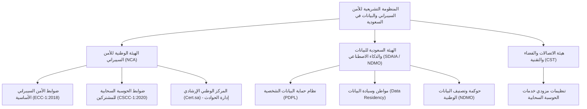
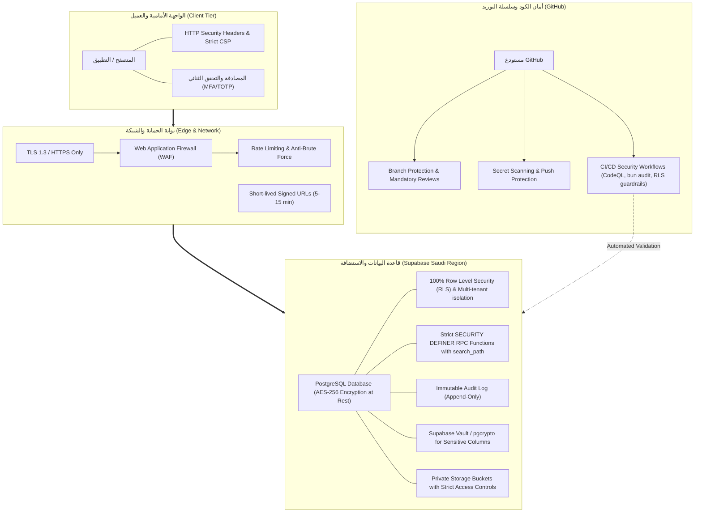

# الدليل الشامل لمتطلبات الأمن السيبراني في المملكة العربية السعودية
## حماية المنصات السحابية وقواعد البيانات وتطبيقها عبر GitHub و Supabase

---

## 1. الإطار التنظيمي والتشريعي الإلزامي في المملكة العربية السعودية

تخضع المنصات الرقمية وخدمات الـ SaaS في المملكة العربية السعودية لمجموعة من الضوابط والأنظمة الإلزامية الصادرة عن الهيئات الوطنية:



---

### أ. الهيئة الوطنية للأمن السيبراني (NCA)

#### 1. ضوابط الأمن السيبراني الأساسية (ECC-1:2018)
تتكون من خمسة مجالات رئيسية تنبثق منها الضوابط التقنية والإدارية:
1. **حوكمة الأمن السيبراني (Governance)**:
   - تحديد وتوثيق الأدوار والمسؤوليات وصلاحيات الأمن السيبراني.
   - مراجعة سياسات الأمان بشكل دوري وإلزام المطورين والمشرفين بتطبيقها.
2. **تعزيز الأمن السيبراني (Defense)**:
   - **إدارة الهوية والوصول (IAM)**: تطبيق مبدأ الصلاحية الأقل (Least Privilege)، والتحقق الثنائي (MFA/2FA) للمشرفين والمستخدمين، وإلغاء صلاحيات الحسابات المعطلة دورياً.
   - **حماية الأنظمة والشبكات وقواعد البيانات**: تشفير البيانات أثناء النقل والتخزين، عزل البيئات (Development / Staging / Production).
   - **إدارة الثغرات وسلسلة التوريد**: فحص الثغرات في الأكواد (SAST) وحزم الاعتماد (Dependency Audit) بصفة دورية وقبل كل دمج أو إطلاق.
   - **حماية البرمجيات**: منع كتابة الأسرار في الشيفرة المصدرية وتطبيق آليات الأمان في دورة حياة تطوير البرمجيات (Secure SDLC).
3. **صمود الأمن السيبراني (Resilience)**:
   - إدارة النسخ الاحتياطي (Backups) وحمايتها من التلف والبرمجيات الخبيثة.
   - خطة استمرارية الأعمال (BCP) والتعافي من الكوارث (DRP) مع تحديد مؤشرات التعافي (RTO / RPO).
4. **الأمن السيبراني للأطراف الخارجية والحوسبة السحابية (Third-Party & Cloud)**:
   - تقييم المخاطر السيبرانية لمزودي الخدمات الخارجية والتكاملات (Payment Gateways, Mail Providers).
5. **الاستجابة للحوادث السيبرانية (Incident Management)**:
   - توثيق سجلات التدقيق (Audit Trails) والإبلاغ عن الحوادث السيبرانية للمركز الوطني الإرشادي (Cert.sa).

#### 2. ضوابط الأمن السيبراني للحوسبة السحابية (CSCC-1:2020)
- **عزل المستأجرين (Multi-tenant Isolation)**: ضمان عدم وصول أي منظمة أو مكتب لبيانات مكتب آخر تحت أي ظرف.
- **إدارة مفاتيح التشفير (Key Management)**: تشفير البيانات باستخدام خوارزميات معتمدة (AES-256, TLS 1.3) وإدارة المفاتيح عبر خزائن مؤمنة (Vaults).
- **تقييد صلاحيات موظفي الدعم**: منع أي موظف بالمنصة من الاطلاع على بيانات المكاتب إلا بإذن صريح محدد بوقت وسبب موثق (Support Access Grants).

---

### ب. الهيئة السعودية للبيانات والذكاء الاصطناعي (سدايا - SDAIA) و (NDMO)

#### 1. نظام حماية البيانات الشخصية (PDPL) ولائحته التنفيذية
- **سيادة ومواطن البيانات (Data Residency)**: إلزامية حفظ ومعالجة واستضافة البيانات الشخصية والقانونية داخل النطاق الجغرافي للمملكة العربية السعودية، وعدم نقلها خارج المملكة إلا وفق ضوابط محددة ومعتمدة من سدايا.
- **مبادئ المعالجة الأساسية**:
  - الشفافية وإشعار الخصوصية (Privacy Notice).
  - تحديد الغرض وجمع الحد الأدنى من البيانات (Data Minimization).
  - الاحتفاظ بالبيانات فقط للمدة اللازمة وتحقيق أهدافها النظامية ثم إتلافها بأمان.
- **حقوق صاحب البيانات (Data Subject Rights)**:
  - الحق في الاطلاع والوصول إلى بياناته الشخصية.
  - الحق في طلب تصحيح أو تحديث البيانات.
  - الحق في طلب إتلاف أو مسح البيانات بعد انتهاء الغرض منها.
  - الحق في سحب الموافقة.
- **الإبلاغ عن حوادث تسريب البيانات**:
  - إشعار سدايا خلال **72 ساعة** فور العلم بأي تسريب أو اختراق يمس البيانات الشخصية.
  - إشعار أصحاب البيانات فوراً إذا ترتب على التسريب ضرر أو مساس بخصوصيتهم.

#### 2. سياسات حوكمة البيانات وتصنيفها (Data Classification)
- تصنيف البيانات في المنصة إلى 4 مستويات:
  1. **سري للغاية (Top Secret)**: مستندات وقضايا فائقة الحساسية، مفاتيح التشفير، أسرار النظام.
  2. **سري (Secret)**: أرقام الهويات الوطنية، البيانات البنكية، أسرار الموكلين.
  3. **مقيد (Restricted)**: بيانات تشغيلية داخلية للمكاتب، سجلات المهام.
  4. **عام (Public)**: باقات الاشتراك، الشروط والأحكام، الصفحات التسويقية.

---

## 2. الهيكلية التقنية لتأمين المنصة (GitHub + Supabase SaaS)



---

## 3. المتطلبات والتركيب التقني: طبقة GitHub (DevSecOps & Code Security)

### أ. إعدادات حماية المستودع (GitHub Repository Settings)

1. **إلزامية التحقق الثنائي (Require 2FA)**:
   - تفعيل `Require two-factor authentication for everyone in the organization` داخل إعدادات المؤسسة لمنع اختراق حسابات المطورين.
2. **حظر تسريب الأسرار (Secret Scanning & Push Protection)**:
   - الانتقال إلى: `Settings` ➔ `Code security and analysis`.
   - تفعيل **Secret scanning** وتفعيل **Push protection** لمنع عمل Commit أو Push لأي مفتاح API أو سر Supabase.
3. **قواعد حماية الفروع (Branch Protection Rules لفرع `main`)**:
   - الانتقال إلى: `Settings` ➔ `Branches` ➔ `Add rule` (للفرع `main`).
   - تفعيل:
     - `Require a pull request before merging` (مع اشتراط موافقة مراجع واحد على الأقل).
     - `Require status checks to pass before merging` وتحديد الفحوصات الإلزامية:
       * `code-guardrails` (فحص الأسرار والضوابط).
       * `dependency-audit` (فحص أمان الحزم).
       * `db-guardrails` (فحص أمان قاعدة البيانات).
     - `Require signed commits` (إلزام توقيع الـ Commits بمفاتيح GPG/SSH).
     - `Do not allow bypassing the above settings`.
     - منع Force Pushing ومنع حذف الفروع.
4. **تأمين بيئات العمل والأسرار (GitHub Environments & Secrets)**:
   - فصل الأسرار إلى بيئتين: `staging` و `production`.
   - عدم تخزين مفاتيح مثل `SERVICE_ROLE_KEY` أو كلمات مرور قواعد البيانات إلا كـ `Repository Secrets` / `Environment Secrets`.

---

### ب. خطوط أنابيب الفحص الأمني التلقائي (GitHub Actions Security Workflows)

يتم ضبط سير عمل شامل لفحص الثغرات والأسرار وحوكمة الشيفرة وقواعد البيانات قبل كل دمج في `.github/workflows/security.yml`.

---

## 4. المتطلبات والتركيب التقني: طبقة Supabase & PostgreSQL

### أ. مواطن وسيادة البيانات واستضافة Supabase في السعودية
1. **اختيار المنطقة الجغرافية**:
   - يجب استضافة مشروع Supabase إما في منطقة **AWS me-central-1 (الرياض / الشرق الأوسط)** أو عبر الاستضافة الخاصة (Self-hosted Supabase on Local KSA Cloud: مثل STC Cloud أو Mobily Cloud أو Oracle Cloud Riyadh Region).
   - تفعيل التشفير أثناء النقل (TLS 1.3 فقط) مع منع أي اتصالات غير مشفرة (Enforce SSL).

---

### ب. تطبيق أمان مستوى الصفوف (Row Level Security - RLS) بنسبة 100%

قاعدة إلزامية: **لا يوجد أي جدول في المخطط `public` بدون RLS.**

```sql
-- 1. تفعيل RLS إجبارياً على جميع الجداول
ALTER TABLE public.organizations ENABLE ROW LEVEL SECURITY;
ALTER TABLE public.cases ENABLE ROW LEVEL SECURITY;
ALTER TABLE public.case_documents ENABLE ROW LEVEL SECURITY;
ALTER TABLE public.clients ENABLE ROW LEVEL SECURITY;
ALTER TABLE public.invoices ENABLE ROW LEVEL SECURITY;
ALTER TABLE public.audit_logs ENABLE ROW LEVEL SECURITY;

-- 2. إغلاق الصلاحيات الافتراضية وسحبها من anon و PUBLIC
REVOKE ALL ON ALL TABLES IN SCHEMA public FROM anon, PUBLIC;
GRANT SELECT, INSERT, UPDATE, DELETE ON ALL TABLES IN SCHEMA public TO authenticated;
GRANT ALL ON ALL TABLES IN SCHEMA public TO service_role;
```

#### نموذج سياسة عزل المستأجر الصارمة (Multi-Tenant Isolation Policy)

```sql
-- سياسة الوصول لقضايا المكتب القانوني: يرى المحامي فقط قضايا المنظمة التي ينتمي إليها
CREATE POLICY "tenant_isolation_cases_select"
ON public.cases
FOR SELECT
TO authenticated
USING (
  organization_id IN (
    SELECT org_id FROM public.organization_members
    WHERE user_id = auth.uid() AND is_active = true
  )
);

-- سياسة التعديل: تقتصر على الأدوار المصرح لها داخل نفس المنظمة
CREATE POLICY "tenant_isolation_cases_update"
ON public.cases
FOR UPDATE
TO authenticated
USING (
  organization_id IN (
    SELECT org_id FROM public.organization_members
    WHERE user_id = auth.uid() 
      AND is_active = true 
      AND role IN ('owner', 'admin', 'lawyer')
  )
)
WITH CHECK (
  organization_id IN (
    SELECT org_id FROM public.organization_members
    WHERE user_id = auth.uid() 
      AND is_active = true 
      AND role IN ('owner', 'admin', 'lawyer')
  )
);
```

---

### ج. تحصين الدوال الخادمة (RPC & SECURITY DEFINER Functions)

عند استخدام `SECURITY DEFINER`، يجب اتباع الضوابط التالية لمنع تصعيد الصلاحيات وحقن المسارات:

```sql
CREATE OR REPLACE FUNCTION public.secure_update_case_status(
  _case_id UUID,
  _new_status TEXT
)
RETURNS VOID
LANGUAGE plpgsql
SECURITY DEFINER
SET search_path = public, pg_temp -- حماية ضد Search Path Poisoning
AS $$
DECLARE
  _caller_org_id UUID;
  _case_org_id UUID;
BEGIN
  -- 1. التحقق من وجود مستخدم مسجل الدخول
  IF auth.uid() IS NULL THEN
    RAISE EXCEPTION 'FORBIDDEN: غير مصرح بالوصول بدون تسجيل الدخول' USING ERRCODE = '42501';
  END IF;

  -- 2. استخراج منظمة القضية
  SELECT organization_id INTO _case_org_id FROM public.cases WHERE id = _case_id;
  IF _case_org_id IS NULL THEN
    RAISE EXCEPTION 'NOT_FOUND: القضية غير موجودة' USING ERRCODE = 'P0002';
  END IF;

  -- 3. التحقق من عضوية وصلاحية المستخدم في نفس المنظمة
  SELECT organization_id INTO _caller_org_id
  FROM public.organization_members
  WHERE user_id = auth.uid() 
    AND organization_id = _case_org_id 
    AND is_active = true 
    AND role IN ('owner', 'admin', 'lawyer');

  IF _caller_org_id IS NULL THEN
    RAISE EXCEPTION 'FORBIDDEN: لا تملك صلاحية تعديل حالة هذه القضية' USING ERRCODE = '42501';
  END IF;

  -- 4. تنفيذ التعديل بأمان
  UPDATE public.cases SET status = _new_status, updated_at = NOW() WHERE id = _case_id;

  -- 5. تسجيل الحدث في سجل التدقيق غير القابل للتعديل
  INSERT INTO public.audit_logs (user_id, organization_id, action, resource_type, resource_id, details)
  VALUES (auth.uid(), _case_org_id, 'UPDATE_STATUS', 'cases', _case_id, jsonb_build_object('new_status', _new_status));
END;
$$;

-- سحب الصلاحية من العامة ومنحها فقط للمصادقين
REVOKE EXECUTE ON FUNCTION public.secure_update_case_status FROM PUBLIC, anon;
GRANT EXECUTE ON FUNCTION public.secure_update_case_status TO authenticated;
```

---

### د. سجل التدقيق غير القابل للتعديل (Immutable Audit Log) - متطلب سدايا و NCA

وفق ضوابط NCA ECC و PDPL، يجب تسجيل جميع العمليات الإدارية والحساسة مع منع تعديلها أو حذفها:

```sql
-- إنشاء جدول سجل التدقيق
CREATE TABLE IF NOT EXISTS public.audit_logs (
    id UUID PRIMARY KEY DEFAULT gen_random_uuid(),
    created_at TIMESTAMPTZ NOT NULL DEFAULT NOW(),
    user_id UUID REFERENCES auth.users(id) ON DELETE SET NULL,
    organization_id UUID REFERENCES public.organizations(id) ON DELETE CASCADE,
    action TEXT NOT NULL,
    resource_type TEXT NOT NULL,
    resource_id UUID,
    ip_address INET,
    user_agent TEXT,
    details JSONB DEFAULT '{}'::jsonb
);

-- تفعيل RLS على جدول التدقيق
ALTER TABLE public.audit_logs ENABLE ROW LEVEL SECURITY;

-- السماح بالقراءة فقط لمالك المنظمة أو مسؤول الامتثال
CREATE POLICY "audit_logs_select_policy"
ON public.audit_logs
FOR SELECT
TO authenticated
USING (
  organization_id IN (
    SELECT org_id FROM public.organization_members
    WHERE user_id = auth.uid() AND is_active = true AND role = 'owner'
  )
);

-- منع الـ INSERT / UPDATE / DELETE المباشر من العميل (يتم الإدراج فقط عبر Functions / Triggers الخادمة)
CREATE POLICY "audit_logs_no_client_insert" ON public.audit_logs FOR INSERT TO authenticated WITH CHECK (false);
CREATE POLICY "audit_logs_no_client_update" ON public.audit_logs FOR UPDATE TO authenticated USING (false);
CREATE POLICY "audit_logs_no_client_delete" ON public.audit_logs FOR DELETE TO authenticated USING (false);

-- إنشاء تريغر يمنع الحذف والتعديل حتى على مستوى قاعدة البيانات
CREATE OR REPLACE FUNCTION public.prevent_audit_log_mutation()
RETURNS TRIGGER AS $$
BEGIN
    RAISE EXCEPTION 'محظور أمنياً: سجلات التدقيق غير قابلة للتعديل أو الحذف امتثالاً لضوابط الأمن السيبراني';
    RETURN NULL;
END;
$$ LANGUAGE plpgsql;

CREATE TRIGGER trg_protect_audit_logs
BEFORE UPDATE OR DELETE ON public.audit_logs
FOR EACH ROW EXECUTE FUNCTION public.prevent_audit_log_mutation();
```

---

### هـ. تأمين التخزين والملفات (Supabase Storage Hardening)

1. **جميع حاويات التخزين (Buckets) خاصة بالكامل (Private)**:
   - تعطيل خيار `Public Bucket` لجميع حاويات المستندات القضائية، الفواتير، والعقود.
2. **سياسات RLS على `storage.objects`**:

```sql
-- سياسة قراءة الملفات: المصادق المصرح له فقط داخل مكتبه
CREATE POLICY "secure_storage_read_policy"
ON storage.objects
FOR SELECT
TO authenticated
USING (
  bucket_id = 'case-documents' 
  AND (storage.foldername(name))[1] IN (
    SELECT org_id::text FROM public.organization_members
    WHERE user_id = auth.uid() AND is_active = true
  )
);

-- سياسة رفع الملفات: التحقق من الحجم والامتدادات المسموح بها
CREATE POLICY "secure_storage_upload_policy"
ON storage.objects
FOR INSERT
TO authenticated
WITH CHECK (
  bucket_id = 'case-documents'
  AND (storage.foldername(name))[1] IN (
    SELECT org_id::text FROM public.organization_members
    WHERE user_id = auth.uid() AND is_active = true
  )
);
```

3. **الوصول عبر الروابط الموقعة قصيرة الأجل (Signed URLs)**:
   - عدم إرجاع روابط دائمة للملفات، واستخدام روابط موقعة بصلاحية تتراوح بين **5 إلى 15 دقيقة** فقط.

---

### و. تشفير البيانات الحساسة على مستوى العمود (Column-level Encryption & Vault)

لتشفير البيانات شديدة الحساسية (مثل أرقام الهويات الوطنية، الحسابات البنكية، أسرار التكاملات):

```sql
-- تفعيل إضافة pgcrypto
CREATE EXTENSION IF NOT EXISTS pgcrypto WITH SCHEMA extensions;
```

---

## 5. متطلبات واجهة الويب والمتصفح (Frontend & Edge Security)

### أ. ترويسات الأمان (HTTP Security Headers)
يجب ضبط ترويسات الاستجابة في الخادم / CDN / Vite / Cloudflare:

```http
Strict-Transport-Security: max-age=31536000; includeSubDomains; preload
X-Frame-Options: DENY
X-Content-Type-Options: nosniff
Referrer-Policy: strict-origin-when-cross-origin
Permissions-Policy: camera=(), microphone=(), geolocation=(), payment=()
Content-Security-Policy: default-src 'self'; script-src 'self'; style-src 'self' 'unsafe-inline'; img-src 'self' data: https:; connect-src 'self' https://*.supabase.co; frame-ancestors 'none';
```

### ب. سياسات كلمات المرور وإدارة الجلسات (IAM Controls)
1. **طول كلمة المرور**: 12 خانة على الأقل مع إلزامية احتوائها على (حرف كبير، حرف صغير، رقم، رمز خاص).
2. **التحقق الثنائي (MFA/TOTP)**: إلزامي لجميع المشرفين والمحامين.
3. **قفل الحساب (Account Lockout)**: إيقاف الحساب مؤقتاً لمدة 15 دقيقة بعد 5 محاولات دخول فاشلة متتالية لمنع هجمات التخمين (Brute-Force Attacks).
4. **مهلة عدم النشاط (Session Idle Timeout)**: تسجيل خروج تلقائي بعد 30 دقيقة من عدم النشاط.

---

## 6. مصفوفة التحقق والامتثال الدوري (Cybersecurity Audit Checklist)

| المجال | المتطلب | المرجع النظامي | الحالة في مِهلة | طريقة التحقق |
| :--- | :--- | :--- | :--- | :--- |
| **سيادة البيانات** | استضافة البيانات بالكامل داخل المملكة | PDPL / NDMO | ✅ إلزامي | التحقق من منطقة السحابة (KSA Region) |
| **عزل البيانات** | تفعيل RLS على 100% من الجداول | NCA CSCC / ECC | ✅ مكتمل | `bun run security:db` |
| **سلسلة التوريد** | فحص ثغرات الحزم والأسرار | NCA ECC-2-10 | ✅ مكتمل | `bun run security:check` + `bun audit` |
| **حماية الفروع** | حظر الدمج المباشر وإلزام الـ PR | NCA ECC-2-10 | ✅ إلزامي | GitHub Branch Protection Rules |
| **سجلات التدقيق** | سجلات غير قابلة للتعديل أو الحذف | NCA ECC-2-8 | ✅ مكتمل | `trg_protect_audit_logs` |
| **التخزين** | حاويات خاصة وروابط موقعة قصيرة | NCA ECC-2-4 | ✅ مكتمل | Private Buckets + Signed URLs |
| **النسخ الاحتياطي** | تفعيل PITR ونسخ مشفرة دورية | NCA ECC-3-1 | ✅ إلزامي | PITR Enabled on Supabase |
| **التحقق الثنائي** | MFA/2FA للمشرفين والمحامين | NCA ECC-2-1 | ✅ متاح | Supabase MFA Enrollment |

---
**خلاصة التطبيق**: باتباع هذا الدليل، تكون منصة مِهلة محصنة تقنياً ومتوافقة بالكامل مع ضوابط **الهيئة الوطنية للأمن السيبراني (NCA)** ونظام **حماية البيانات الشخصية (PDPL)**.
