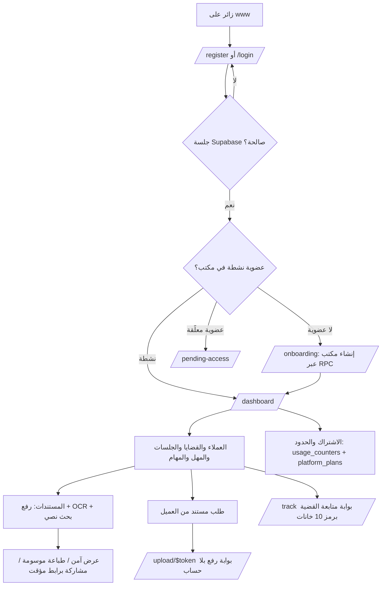
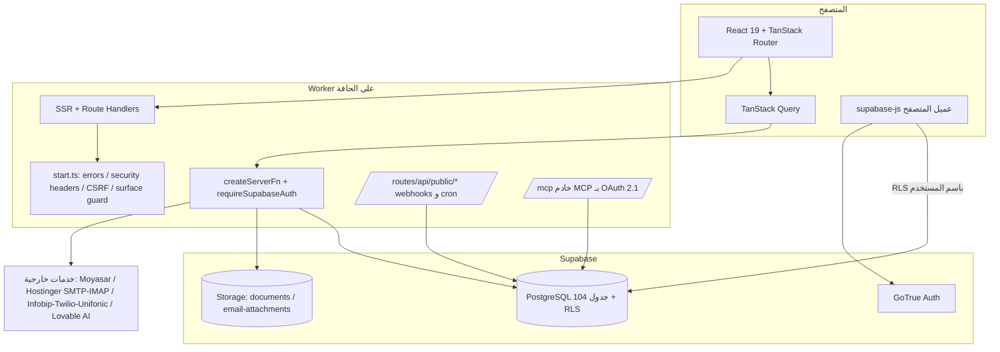
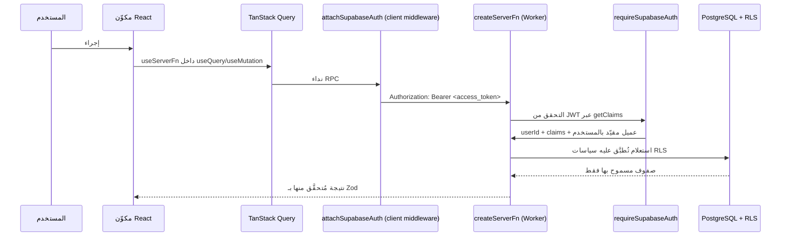
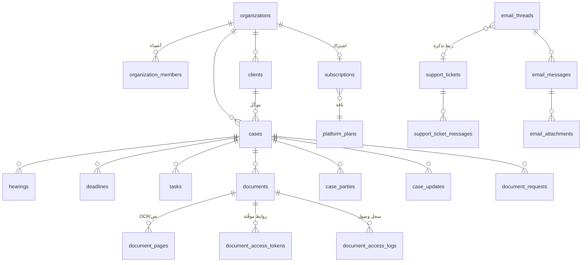
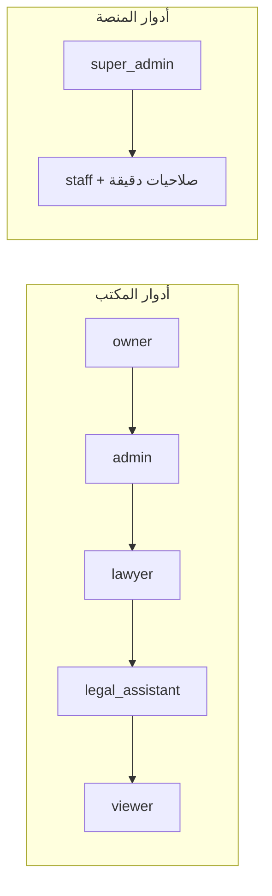
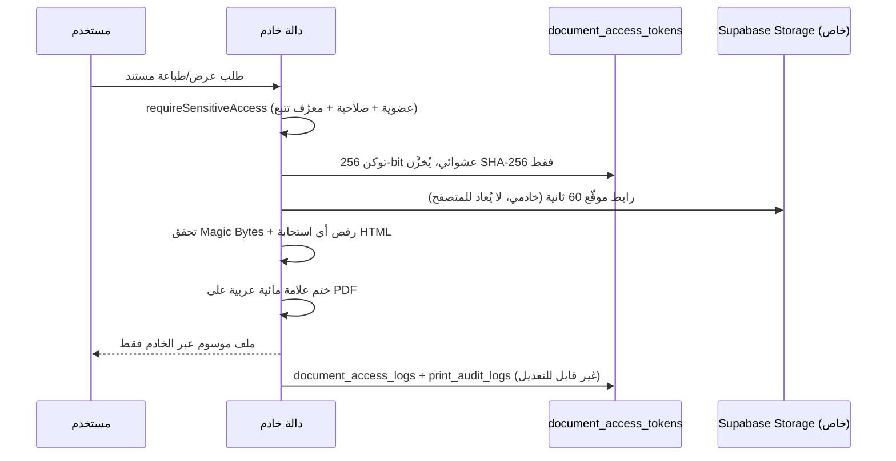
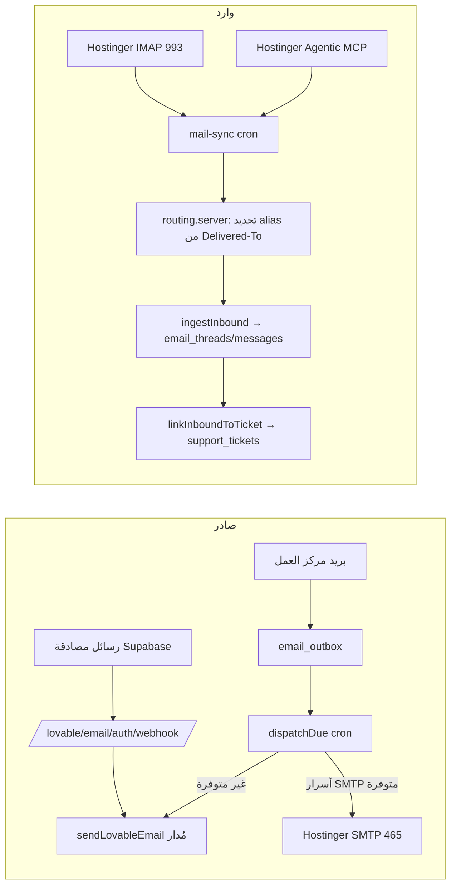

# مِهلة | MEHLA — الوثيقة التقنية المعمارية الشاملة

> **مصدر المعلومات:** الكود الفعلي في هذا المستودع + مخطط قاعدة البيانات الحيّ (استعلامات قراءة فقط).
> أي معلومة غير موجودة في الكود مكتوبة صراحةً بصيغة **(غير موجود حالياً)**.
> تاريخ الإصدار: 2026-08-05 · المُعِدّ: Senior Software Architect

---

## جدول المحتويات

1. [نظرة عامة على المنصة](#1-نظرة-عامة-على-المنصة)
2. [Architecture](#2-architecture)
3. [Tech Stack](#3-tech-stack)
4. [Folder Structure](#4-folder-structure)
5. [Database](#5-database)
6. [Authentication](#6-authentication)
7. [Security](#7-security)
8. [Encryption](#8-encryption)
9. [File Security](#9-file-security)
10. [Email System](#10-email-system)
11. [API Architecture](#11-api-architecture)
12. [Admin Panel](#12-admin-panel)
13. [Performance](#13-performance)
14. [Deployment](#14-deployment)
15. [Third Party Integrations](#15-third-party-integrations)
16. [نقاط القوة (20)](#16-نقاط-القوة-20)
17. [نقاط الضعف](#17-نقاط-الضعف)
18. [اقتراحات مستقبلية](#18-اقتراحات-مستقبلية)
19. [أسئلة قد يسألها مستثمر أو عميل أو مبرمج (100+)](#19-أسئلة-قد-يسألها-مستثمر-أو-عميل-أو-مبرمج)
20. [Executive Summary](#20-executive-summary)

---

## 1. نظرة عامة على المنصة

### 1.1 ما هي المنصة؟

**مِهلة (MEHLA)** منصة SaaS سعودية لإدارة الممارسة القانونية (Legal Practice Management)، موجّهة للمحامين ومكاتب المحاماة والمستشارين والإدارات القانونية. المنتج عربي بالكامل (RTL) ومبني حول متابعة **القضايا، الجلسات، المهل النظامية، المهام، العملاء، والمستندات**، مع بوابة عملاء لمتابعة القضية ورفع المستندات.

المنصة **متعددة المستأجرين (Multi-tenant)** على مستوى «المكتب» (`organizations`)، مع عزل بيانات مفروض في قاعدة البيانات عبر RLS وليس في الواجهة.

**المراجع:** `src/routes/index.tsx` · `src/config/surfaces.ts` · `docs/subdomain-architecture.md` · `docs/rbac-architecture.md`

### 1.2 الهدف

- تقليل الحمل الذهني على المحامي الذي يدير مئات الملفات في آن واحد.
- منع ضياع المهل النظامية (اعتراض، استئناف، رد، تنفيذ…) عبر `deadlines` + `notifications`.
- إدارة مستندات قانونية بحماية عالية (علامة مائية، سجل طباعة غير قابل للتعديل، روابط موقّعة قصيرة العمر).
- تشغيل المنصة كشركة SaaS كاملة: اشتراكات، فوترة، دعم فني، مراقبة، RBAC للمنصة.

### 1.3 كيف تعمل من البداية للنهاية



### 1.4 رحلة المستخدم كاملة

| المرحلة           | المسار                                      | الملف                                                           |
| ----------------- | ------------------------------------------- | --------------------------------------------------------------- |
| التسويق           | `/` `/docs` `/privacy` `/terms`             | `src/routes/index.tsx`, `docs.tsx`, `privacy.tsx`, `terms.tsx`  |
| التسجيل           | `/register` → `/onboarding`                 | `src/routes/register.tsx`, `onboarding.tsx`                     |
| الدخول            | `/login`, Google OAuth, Magic Link          | `src/routes/login.tsx`, `src/lib/auth-actions.ts`               |
| استرجاع الوصول    | `/forgot-password` → `/reset-password`      | نفس الأسماء في `src/routes`                                     |
| العودة من المزوّد | `/auth/callback`, `/auth/verified`          | `src/routes/auth.callback.tsx`, `auth.verified.tsx`             |
| الانضمام بدعوة    | `/invite/$token`                            | `src/routes/invite.$token.tsx`                                  |
| العمل اليومي      | `/dashboard` وما تحت `_authenticated/*`     | `src/routes/_authenticated/**`                                  |
| بوابة العميل      | `/track`, `/upload/$token`, `/share/$token` | `src/routes/track.tsx`, `upload.$token.tsx`, `share.$token.tsx` |
| إدارة المنصة      | `/mehla-admin/**`                           | `src/routes/mehla-admin/**`                                     |

حارس الدخول الفعلي للواجهة: `src/routes/_authenticated/route.tsx:43-52` (توجيه إلى `/login` أو `/pending-access` أو `/onboarding`). الحماية الحقيقية للبيانات على مستوى RLS + دوال الخادم، لا على مستوى المسار.

---

## 2. Architecture

### 2.1 نوع الـ Architecture

**Modular Monolith فوق Serverless Edge**: تطبيق واحد (TanStack Start) يضم الواجهة والخادم معاً، مقسّم داخلياً إلى وحدات مجال (Domain Modules) بحدود صارمة داخل `src/lib/*`، ويُنشر كـ Worker على الحافة. لا يوجد Microservices، ولا Edge Functions منفصلة، ولا طابور رسائل داخلي.

قاعدة الحدود المطبقة في التسمية:

- `*.server.ts` — كود خادمي بحت (يمنع دخوله لحزمة المتصفح).
- `*.functions.ts` — دوال RPC مُصرَّح باستدعائها من العميل (`createServerFn`).
- `*.shared.ts` — أنواع/دوال نقية مشتركة بين الطرفين.

### 2.2 المخطط العام



### 2.3 Frontend Architecture

- **React 19 + TanStack Router v1** بتوجيه قائم على الملفات، وشجرة مسارات مولّدة (`src/routeTree.gen.ts`).
- **الجذر** `src/routes/__root.tsx`: يضبط `<html lang="ar" dir="rtl" data-page=...>` (سطر 151-165)، يحقن الميتاداتا والخط `IBM Plex Sans Arabic`، ويجلب في الـ loader إصدار الثيم المنشور لحقن `/api/public/theme.css` (سطر 88-94، 129-132).
- **السياقات العامة**: `QueryClientProvider` + `AuthProvider` + `useSurfaceGuard()` + `Toaster` (sonner) في `RootComponent` (سطر 167-209).
- **الحالة**: لا Redux/Zustand — الحالة الخادمية في TanStack Query، وحالة الهوية في `useAuth` (`src/hooks/use-auth.tsx`).
- **نظام التصميم**: Tailwind v4 عبر `src/styles.css` بتوكنات OKLCH (`--primary`, `--surface`, `--gold`, `--danger` …) وخريطة `@theme inline`؛ الوضع الداكن معطّل صراحة (`src/styles.css:171-174`).
- **مكتبة المكونات**: shadcn/ui فوق Radix UI في `src/components/ui/**`.

### 2.4 Backend Architecture

- **دوال خادم مكتوبة بالنوع (Typed RPC)** عبر `createServerFn` في 23 ملف `*.functions.ts`، كل دالة: `middleware([requireSupabaseAuth])` → `inputValidator(zodSchema.parse)` → `handler`.
- **مسارات HTTP خام** فقط لما يحتاجها الخارج: `src/routes/api/public/**` (ويبهوك الدفع، ويبهوك البريد الوارد، مهام cron، خدمة الثيم، فحص الصحة، تنزيل المستند بالتوكن).
- **بوابة MCP** (`/mcp`, `/.mcp/*`) بمصادقة OAuth 2.1 صادرها Supabase Auth (`src/lib/mcp/index.ts:8-42`).
- **Middleware عام** في `src/start.ts`: معالجة أخطاء موحّدة، رؤوس أمان، CSRF لدوال الخادم، وحارس النطاقات الفرعية.
- **عميلا Supabase**: عميل المتصفح (RLS باسم المستخدم)، وعميل خادمي مميّز `supabaseAdmin` يُستورد ديناميكياً داخل المعالجات فقط بعد التحقق من المستدعي.

### 2.5 Database Architecture

PostgreSQL على Supabase، 104 جدول في `public` كلها بـ RLS مفعّل، 148 سياسة، 309 فهرس، 113 مُشغّل (Trigger)، 37 دالة في `public` و31 دالة في مخطط `private` المحجوز لمساعدات RLS. لا Views (0). العزل الأساسي على عمود `organization_id` مع دوال `SECURITY DEFINER` في `private` لكسر التكرار (Recursion) في السياسات.

### 2.6 كيف تتواصل الطبقات



**المراجع:** `src/start.ts` · `src/integrations/supabase/auth-middleware.ts:33-108` · `src/integrations/supabase/auth-attacher.ts:7-14` · `src/router.tsx:5-16`

---

## 3. Tech Stack

| الطبقة           | التقنية الفعلية                                                                                                                          | المرجع                                                                            |
| ---------------- | ---------------------------------------------------------------------------------------------------------------------------------------- | --------------------------------------------------------------------------------- |
| Framework        | TanStack Start v1 (SSR + file routing)                                                                                                   | `package.json`, `vite.config.ts`                                                  |
| Frontend         | React 19.2, TypeScript 5.8 (strict)                                                                                                      | `package.json`, `tsconfig.json`                                                   |
| Router           | @tanstack/react-router 1.170                                                                                                             | `src/router.tsx`                                                                  |
| Data fetching    | @tanstack/react-query 5.101                                                                                                              | `src/routes/__root.tsx`                                                           |
| Styling          | Tailwind CSS v4 + `@tailwindcss/vite` + tw-animate-css                                                                                   | `src/styles.css`                                                                  |
| UI Kit           | Radix UI + shadcn/ui + lucide-react + sonner + vaul + cmdk + embla                                                                       | `src/components/ui/**`                                                            |
| Forms/Validation | react-hook-form + @hookform/resolvers + **Zod 3**                                                                                        | `src/lib/*.functions.ts`                                                          |
| Charts           | recharts                                                                                                                                 | لوحات الإدارة                                                                     |
| Backend runtime  | Worker (Cloudflare عبر Nitro) — دوال `createServerFn`                                                                                    | `vite.config.ts`, `src/server.ts`                                                 |
| Database         | PostgreSQL (Supabase)                                                                                                                    | `supabase/migrations/**`                                                          |
| ORM              | **لا يوجد ORM** — عميل `@supabase/supabase-js` + SQL خام في الهجرات                                                                      | `src/integrations/supabase/*`                                                     |
| Auth             | Supabase Auth (GoTrue): كلمة مرور، Google OAuth، Magic Link، TOTP MFA                                                                    | `src/hooks/use-auth.tsx`, `src/lib/mfa.ts`                                        |
| Storage          | Supabase Storage — دلوان خاصان: `documents`, `email-attachments`                                                                         | استعلام `storage.buckets`                                                         |
| Email            | `@lovable.dev/email-js` (صادر مُدار) + SMTP/IMAP خام لـ Hostinger + React Email للقوالب                                                  | `src/lib/email/**`                                                                |
| PDF              | pdf-lib + @pdf-lib/fontkit + pdfjs-dist + mammoth (DOCX)                                                                                 | `src/lib/print/**`, `src/lib/secure-view/**`                                      |
| كلمات المرور     | @zxcvbn-ts + فحص HIBP (k-anonymity)                                                                                                      | `src/lib/password-policy.server.ts`                                               |
| Caching          | TanStack Query في المتصفح + تخزين مؤقت داخل الذاكرة (قدرات Agentic 5 دقائق، DNS 5 دقائق) + `Cache-Control` على `theme.css`. **لا Redis** | `src/lib/email/agentic/provider.server.ts`, `src/lib/integrations/ssrf.server.ts` |
| Build tools      | Vite 8 + Nitro 3 + `@lovable.dev/vite-tanstack-config`                                                                                   | `vite.config.ts`                                                                  |
| Package manager  | Bun (`bunfig.toml`, سكربت `bun scripts/...`)                                                                                             | `package.json`, `bunfig.toml`                                                     |
| Lint/Format      | ESLint 9 + typescript-eslint + Prettier                                                                                                  | `eslint.config.js`, `.prettierrc`                                                 |
| Deployment       | Lovable Cloud → Worker على الحافة، دومين `mehlalex.com`                                                                                  | `src/config/surfaces.ts`                                                          |
| Analytics        | تتبع داخلي خفيف `src/lib/analytics.ts` (**لا GA/Segment**)                                                                               | `src/routes/__root.tsx`                                                           |
| MCP              | `@lovable.dev/mcp-js` — 7 أدوات قانونية                                                                                                  | `src/lib/mcp/**`                                                                  |

**غير موجود حالياً:** Redis، Kafka/طوابير خارجية، Prisma/Drizzle، Next.js، Docker/K8s، Sentry/Datadog، CDN خارجي مستقل عن الاستضافة، مضاد فيروسات فعلي.

---

## 4. Folder Structure

```text
src/
├─ routes/            # التوجيه القائم على الملفات (الواجهة + مسارات HTTP)
│  ├─ __root.tsx      # الجذر: html/dir/rtl, meta, providers, theme.css
│  ├─ index.tsx       # الصفحة التسويقية
│  ├─ _authenticated/ # مساحة المحامين المحمية (dashboard, cases, clients, ...)
│  ├─ mehla-admin/    # لوحة إدارة المنصة (24 مسار)
│  ├─ api/public/     # webhooks + cron + doc.$token + health + theme.css
│  ├─ lovable/email/  # ويبهوك ومعاينة قوالب بريد المصادقة
│  └─ [.mcp]/, mcp.ts # خادم MCP ومساراته
├─ components/
│  ├─ ui/             # shadcn/ui (≈50 مكوّن)
│  ├─ admin/          # shell + billing/ rbac/ mail/ support/ + impersonation-banner
│  ├─ dashboard/, documents/, security/, subscription/, team/, print/,
│  └─ notifications/, marketing/, track/
├─ hooks/             # use-auth, use-platform-admin, use-subscription, use-surface-guard, ...
├─ lib/               # منطق الأعمال (أكبر مجلد)
│  ├─ billing/  rbac/  support/  email/  email-templates/  integrations/
│  ├─ design/   secure-view/  print/  crypto/  sms/  documents/  drafts/
│  ├─ mcp/      observability/  security/
│  └─ ملفات جذرية: admin-permissions.ts, admin-guard.server.ts, doc-permissions.ts,
│                  password-policy.*, pii.*, csv.ts, audit.ts, subscription.*
├─ integrations/supabase/   # client.ts (متصفح), client.server.ts (admin), auth-middleware.ts, types.ts
├─ config/surfaces.ts       # سجل النطاقات الفرعية — مصدر الحقيقة الوحيد
├─ styles.css               # Design Tokens + Tailwind v4
├─ router.tsx, server.ts, start.ts
docs/                        # 7 وثائق معمارية (RBAC, Billing, Support, Email, Hostinger, Guardrails, Subdomains)
scripts/                     # security-guardrails.ts + .sql + اختبارات e2e للبريد
supabase/migrations/         # 50+ ملف هجرة SQL
```

### 4.1 وظيفة الملفات الرئيسية

| الملف                                                | الوظيفة                                                                             |
| ---------------------------------------------------- | ----------------------------------------------------------------------------------- |
| `src/router.tsx:5-16`                                | إنشاء `QueryClient` لكل طلب وتمريره في سياق الراوتر                                 |
| `src/server.ts:21-70`                                | نقطة دخول SSR مع تطبيع أخطاء h3 وصفحة خطأ عربية                                     |
| `src/start.ts:9-80`                                  | أربع طبقات middleware: أخطاء، رؤوس أمان، CSRF، حارس النطاقات + `attachSupabaseAuth` |
| `src/config/surfaces.ts`                             | تحديد أي مسار يُخدم على أي نطاق فرعي (app/client/upload/status/api/docs/www…)       |
| `src/lib/admin-permissions.ts:10-208`                | تعريف ~80 صلاحية منصة + `hasPermission` + توسعة الأسماء القديمة                     |
| `src/lib/admin-guard.server.ts:26-99`                | `requireStaff` + `writeAudit` لكل عملية إدارية                                      |
| `src/lib/doc-permissions.ts:30-51`                   | مصفوفة صلاحيات المستندات/الطباعة لكل دور مكتب                                       |
| `src/lib/security/sensitive-guard.server.ts:125-157` | حارس موحّد لأي عملية حساسة (عضوية + صلاحية + معرّف تتبع + AAL)                      |
| `src/lib/crypto/pii.server.ts`                       | تشفير PII: AES-256-GCM + HKDF-SHA256 + Blind Index                                  |
| `src/lib/secure-view/secure-view.server.ts`          | توكنات وصول المستندات، الروابط الموقّتة، التحقق من المحتوى                          |
| `src/lib/email/workspace.server.ts`                  | مركز البريد: صناديق، محادثات، صادر، إرسال، قفل ذرّي                                 |
| `scripts/security-guardrails.ts`                     | فحص أمان آلي: أسرار مكتوبة، تسريب VITE\_\*، توثيق RPC                               |

---

## 5. Database

### 5.1 أرقام حقيقية (استعلام حيّ)

| المؤشر                          | القيمة                                                |
| ------------------------------- | ----------------------------------------------------- |
| جداول `public`                  | 104                                                   |
| جداول بـ RLS مفعّل              | **104 / 104 (100%)**                                  |
| سياسات RLS                      | 148                                                   |
| فهارس                           | 309                                                   |
| مُشغّلات (Triggers) غير داخلية  | 113                                                   |
| دوال في `public`                | 37                                                    |
| دوال في `private` (مساعدات RLS) | 31                                                    |
| Views                           | 0 (**غير موجود حالياً**)                              |
| دلاء التخزين                    | 2 (`documents`, `email-attachments`) — كلاهما **خاص** |

### 5.2 مجموعات الجداول

| المجال          | الجداول                                                                                                                                                                                                                                                                                                                                                                                                                     |
| --------------- | --------------------------------------------------------------------------------------------------------------------------------------------------------------------------------------------------------------------------------------------------------------------------------------------------------------------------------------------------------------------------------------------------------------------------- |
| الهوية والمكاتب | `profiles`, `organizations`, `organization_members`, `organization_invitations`                                                                                                                                                                                                                                                                                                                                             |
| العمل القانوني  | `cases`, `clients`, `case_parties`, `case_updates`, `hearings`, `deadlines`, `tasks`, `activity_logs`                                                                                                                                                                                                                                                                                                                       |
| بوابة العميل    | `case_code_registry`, `case_lookup_attempts`, `document_requests`, `document_request_events`                                                                                                                                                                                                                                                                                                                                |
| المستندات       | `documents`, `document_pages`, `document_processing_jobs`, `document_access_tokens`, `document_access_logs`, `print_audit_logs`                                                                                                                                                                                                                                                                                             |
| صلاحيات دقيقة   | `case_party_permissions`, `case_party_audit_logs`                                                                                                                                                                                                                                                                                                                                                                           |
| الاشتراكات      | `subscriptions`, `platform_plans`, `usage_counters`, `invoices`                                                                                                                                                                                                                                                                                                                                                             |
| المركز المالي   | `platform_invoices`, `platform_invoice_items`, `platform_payments`, `platform_payment_attempts`, `platform_refunds`, `platform_credit_notes`, `platform_bank_reconciliations`, `platform_financial_periods`, `platform_period_reopen_approvals`, `platform_number_sequences`, `platform_coupons`, `platform_coupon_redemptions`, `platform_payment_provider_configs`, `platform_payment_webhooks`, `platform_billing_notes` |
| RBAC للمنصة     | `platform_staff`, `platform_roles`, `platform_departments`, `platform_permission_grants`, `platform_approval_requests`, `platform_staff_sessions`, `platform_staff_restrictions`, `platform_impersonation_sessions`, `platform_impersonation_events`, `admin_audit_logs`                                                                                                                                                    |
| البريد          | `email_mailboxes`, `email_threads`, `email_messages`, `email_attachments`, `email_outbox`, `email_inbound_events`, `email_sync_state`, `email_sync_runs`, `email_labels`, `email_thread_labels`, `email_notes`, `email_audit_logs`                                                                                                                                                                                          |
| الدعم           | `support_tickets`, `support_ticket_messages`, `support_ticket_events`, `support_ticket_tags`, `support_tags`, `support_internal_notes`, `support_teams`, `support_team_members`, `support_categories`, `support_sla_policies`, `support_sla_events`, `support_escalation_rules`, `support_business_calendars`, `support_holidays`, `support_csat_invitations`, `support_ticket_ingest`, `support_access_grants`             |
| الأمان والتشفير | `encryption_key_registry`, `pii_access_logs`, `pii_reencryption_jobs`, `otp_verifications`, `integration_secrets`                                                                                                                                                                                                                                                                                                           |
| التشغيل         | `notifications`, `user_notification_preferences`, `system_failures`, `integration_definitions`, `platform_integrations`, `integration_health_logs`, `sms_settings`, `sms_delivery_logs`, `platform_settings`, `platform_broadcasts`, `platform_email_templates`, `platform_user_notes`                                                                                                                                      |
| Design Studio   | `design_themes`, `design_versions`, `design_drafts`, `design_publish_state`, `design_audit_logs`                                                                                                                                                                                                                                                                                                                            |

### 5.3 العلاقات الأساسية



- **Primary Keys:** كل الجداول تستخدم `uuid` مع `gen_random_uuid()` كمفتاح أساسي.
- **Foreign Keys:** ~120 قيداً؛ العمود المحوري `organization_id → organizations.id` في كل جداول المستأجرين، و`created_by/user_id → profiles.id` (أو `auth.users` في جداول الصلاحيات).
- **Indexes:** 309 فهرساً — تشمل مفاتيح فريدة (`unique(user_id, role)` نمط RBAC)، فهارس `organization_id`، فهرس بحث نصي كامل يستعمله `search_document_pages`، وفهارس تفرّد لمنع التكرار في البريد (`email_outbox.message_id`, `support_ticket_ingest.dedupe_key`).

### 5.4 دوال قاعدة البيانات

- **11 دالة فقط** مسموح استدعاؤها من دور `authenticated`، وكلها موثّقة إجبارياً في `docs/security-guardrails.md` (أي دالة جديدة غير موثّقة تُفشِل الفحص الآلي): `admin_platform_metrics`, `billing_reports`, `billing_save_draft`, `billing_match_reconciliation`, `billing_reopen_period`, `create_organization_with_owner`, `my_subscription_overview`, `my_case_party_permissions`, `consume_ocr_pages`, `record_metered_usage`, `print_copy_number`.
- **مخطط `private` (31 دالة)** لمساعدات RLS بصلاحيات `SECURITY DEFINER` — أهمها: `is_organization_member`, `has_organization_role`, `can_access_case`, `is_platform_staff`, `is_platform_super_admin`, `has_platform_permission`, `effective_platform_permissions`, `org_subscription_state`, `enforce_plan_quota`, `has_case_party_permission`, `has_active_support_access`.
- **Triggers (113)** — أمثلة موثّقة: `set_updated_at`, `handle_new_user` (إنشاء `profiles` بعد التسجيل)، `cases_set_public_code` (توليد رمز القضية 10 خانات)، `strip_plaintext_pii` (منع تخزين PII كنص صريح)، `deny_update`/`deny_hard_delete` (سجلات غير قابلة للتعديل/الحذف)، `invoice_immutability_guard`, `billing_period_guard`, `payment_amount_guard`, `refund_amount_guard`, `case_parties_audit`, `print_audit_enforce_actor`, `activity_logs_enforce_actor`, `pii_access_logs_enforce_actor`.
- **Views:** غير موجود حالياً (0).

### 5.5 Storage Buckets

| الدلو               | عام؟ | الاستخدام                                         |
| ------------------- | ---- | ------------------------------------------------- |
| `documents`         | خاص  | مستندات القضايا والعملاء + النسخ الموسومة المؤقتة |
| `email-attachments` | خاص  | مرفقات البريد بعد فحص Magic Bytes                 |

الوصول دائماً عبر روابط موقّعة قصيرة العمر تُولَّد خادمياً؛ لا وصول مباشر عام.

---

## 6. Authentication

### 6.1 المصدر

كل المصادقة مبنية على **Supabase Auth (GoTrue)** — لا يوجد نظام جلسات مخصص ولا تخزين كلمات مرور داخل المستودع.

### 6.2 الطرق المدعومة

| الطريقة                 | الحالة                                           | المرجع                                                    |
| ----------------------- | ------------------------------------------------ | --------------------------------------------------------- |
| بريد + كلمة مرور        | مفعّل                                            | `src/hooks/use-auth.tsx:261-268`                          |
| Google OAuth            | مفعّل                                            | `src/lib/auth-actions.ts`, `src/routes/auth.callback.tsx` |
| Magic Link              | مفعّل مع `shouldCreateUser: false`               | `src/lib/auth-actions.ts:11,31-38`                        |
| إعادة تعيين كلمة المرور | مفعّل + إعادة تأكيد الهوية (`nonce`) قبل التغيير | `src/lib/auth-actions.ts:63-71`                           |
| تأكيد البريد            | عبر قوالب المنصة (`signup`, `email_change`)      | `src/routes/lovable/email/auth/webhook.ts`                |
| TOTP MFA                | **اختياري**، السر لا يمر بخوادم التطبيق          | `src/lib/mfa.ts:1-56`                                     |
| OTP عبر SMS             | مسار مستقل لتوثيق الجوال + MFA اختياري           | `src/lib/sms/otp.server.ts`                               |
| SAML/OIDC مؤسسي         | **غير موجود حالياً**                             | —                                                         |

### 6.3 الجلسات والرموز

- الجلسة يديرها Supabase (Access JWT + Refresh Token) والتجديد تلقائي؛ `onAuthStateChange` هو مستمع الحقيقة الوحيد (`use-auth.tsx:230-259`)، ولا يُعاد تحميل الملف الشخصي عند `TOKEN_REFRESHED` لتفادي الوميض.
- كل نداء RPC يُرفق تلقائياً برأس `Authorization: Bearer` عبر `attachSupabaseAuth` (`src/integrations/supabase/auth-attacher.ts:7-14`).
- على الخادم: `requireSupabaseAuth` يتحقق من شكل JWT (3 أجزاء) ثم `supabase.auth.getClaims(token)` فعلياً مع Supabase، ويرمي `Unauthorized` عند الفشل (`auth-middleware.ts:33-108`).
- **AAL (مستوى التحقق)**: يُستخرج من الـ claims ويُسجَّل في التدقيق، لكنه **لا يمنع** أي عملية حالياً (`sensitive-guard.server.ts:155-157`).

### 6.4 سياسة كلمة المرور

12 حرفاً كحد أدنى (حتى 128)، حرف كبير وصغير ورقم ورمز، منع تضمين الاسم/البريد، منع الشائعة، درجة **zxcvbn ≥ 3**، ثم فحص **HIBP** بأسلوب k-anonymity (أول 5 أحرف من SHA-1 فقط تُرسل).
**المراجع:** `src/lib/password-policy.ts:7-144` · `password-policy.server.ts:48-106` · `hibp.shared.ts:12-31`

### 6.5 RBAC بمستويين منفصلين



- أدوار المكتب في `organization_members.role` (نوع `app_role`)، تُفرض داخل RLS ومصفوفة `doc-permissions.ts`.
- صلاحيات المنصة (~80 صلاحية) في `admin-permissions.ts`، وتُفرض عبر `requireStaff`.
- **قاعدة معلنة في الكود:** لا توجد صلاحية تمنح موظف المنصة الاطلاع على بيانات المكاتب؛ الاستثناء الوحيد منحة `support_access_grants` موقّتة وموثّقة.

---

## 7. Security

| المحور               | التطبيق الفعلي                                                                                                                                                                 | المرجع                                                                          |
| -------------------- | ------------------------------------------------------------------------------------------------------------------------------------------------------------------------------ | ------------------------------------------------------------------------------- |
| RLS                  | 104/104 جدول، 148 سياسة، مساعدات `private.*` لكسر التكرار                                                                                                                      | استعلام حيّ + الهجرات                                                           |
| SQL Injection        | لا SQL مُركَّب من مدخلات؛ كل الوصول عبر عميل Supabase المُعامَل (parameterized) ودوال RPC                                                                                      | `src/lib/**`                                                                    |
| XSS                  | React يهرّب المخرجات افتراضياً + تعقيم HTML للبريد                                                                                                                             | `src/lib/email/sanitize.shared.ts`                                              |
| CSP                  | رؤوس CSP كاملة، ونسخة مشددة للاستجابات الثنائية                                                                                                                                | `security-headers.server.ts:7-59`                                               |
| CSRF                 | `createCsrfMiddleware` مفعّل يدوياً لدوال الخادم                                                                                                                               | `src/start.ts:65-67`                                                            |
| Rate Limiting        | OTP: حد بالساعة + مهلة إعادة إرسال؛ ويبهوك البريد: 60/دقيقة؛ كشف PII: 8/10د و25/ساعة                                                                                           | `otp.server.ts:254-288`, `email-inbound.ts:149-164`, `security-policy.ts:34-39` |
| Brute Force          | `max_attempts` لكل رمز OTP + إبطال إجباري                                                                                                                                      | `otp.server.ts:514-520`                                                         |
| Input Validation     | Zod على كل دالة خادم وكل ويبهوك                                                                                                                                                | `*.functions.ts`                                                                |
| File Validation      | Magic Bytes + رفض المحتوى النشط + SHA-256                                                                                                                                      | `attachments.server.ts:38-103`                                                  |
| Virus Scanning       | **غير موجود حالياً** — معلن بصدق `scan_status: "not_scanned"`                                                                                                                  | `attachments.server.ts:208-209`                                                 |
| Watermark            | ختم خادمي فقط على PDF                                                                                                                                                          | `src/lib/secure-view/stamp.server.ts`                                           |
| Signed URLs          | 60 ثانية للقراءة الخادمية، TTL قصير للمرفقات                                                                                                                                   | `secure-view.server.ts:283-352`                                                 |
| Encryption           | AES-256-GCM + HKDF-SHA256 للـ PII وأسرار التكاملات                                                                                                                             | `crypto/pii.server.ts`, `integrations/vault.server.ts`                          |
| Password Hashing     | مُفوَّض بالكامل لـ Supabase GoTrue (لا bcrypt/argon2 في المستودع)                                                                                                              | —                                                                               |
| Secrets Management   | خزنة مشفّرة في القاعدة + متغيرات بيئة خادمية فقط + فحص آلي                                                                                                                     | `vault.server.ts`, `scripts/security-guardrails.ts`                             |
| Audit Logs           | `admin_audit_logs`, `activity_logs`, `print_audit_logs`, `pii_access_logs`, `case_party_audit_logs`, `design_audit_logs`, `email_audit_logs` — مع Triggers تختم الفاعل خادمياً | `audit.ts:16-19`, `admin-guard.server.ts:73-99`                                 |
| Webhook Verification | HMAC-SHA256 + مقارنة ثابتة الزمن (بريد وارد، Moyasar)                                                                                                                          | `email-inbound.ts:138-217`, `billing/providers.server.ts`                       |
| Replay Protection    | نافذة 300 ثانية + بصمة SHA-256 للحمولة؛ توكنات المستندات ذات استخدام محدود                                                                                                     | `email-inbound.ts:183-236`, `secure-view.server.ts:161-181`                     |
| SSRF                 | حظر hostnames + IP خاصة (IPv4/IPv6) + فحص DNS-over-HTTPS قبل الاتصال + HTTPS فقط                                                                                               | `integrations/ssrf.server.ts:22-143`                                            |
| CSV Injection        | تحييد `= + - @ tab CR` في التصدير                                                                                                                                              | `src/lib/csv.ts:6,13`                                                           |
| Email Enumeration    | Magic Link يعطي رسالة موحّدة؛ لكن ترجمة أخطاء الدخول تفرّق بين «مستخدم غير موجود» و«بيانات خاطئة» (نقطة ضعف)                                                                   | `auth-errors.ts:39-93`                                                          |
| Surface/Domain Guard | كل مسار محصور بنطاقه الفرعي، وإلا 404 أو تحويل                                                                                                                                 | `surface-guard.server.ts:32-51`                                                 |
| Fail-Closed          | الجداول الخادمية البحتة بلا سياسات ومحصورة بـ `service_role`                                                                                                                   | `docs/security-guardrails.md`                                                   |
| فحص آلي              | `bun run security:check` + `scripts/security-guardrails.sql`                                                                                                                   | `package.json`                                                                  |

---

## 8. Encryption

| السؤال                    | الجواب من الكود                                                                                                                                                      |
| ------------------------- | -------------------------------------------------------------------------------------------------------------------------------------------------------------------- |
| ما الذي يُشفَّر؟          | بيانات التعريف الشخصية للعملاء وأطراف القضية (PII)، وأسرار التكاملات الخارجية (مفاتيح API لمزوّدي SMS والدفع)                                                        |
| AES؟                      | **نعم — AES-256-GCM** مع IV عشوائي 96-bit و AAD تتضمن `organizationId\|field\|version`                                                                               |
| HKDF؟                     | **نعم — HKDF-SHA256** لاشتقاق مفتاح فرعي لكل (مكتب، حقل) من مفتاح رئيسي `MEHLA_MASTER_KEY_V<n>`                                                                      |
| PBKDF2 / Argon2 / bcrypt؟ | **غير مستخدمة داخل المستودع** — تجزئة كلمات المرور تتم كلياً داخل Supabase Auth                                                                                      |
| HMAC؟                     | **نعم — HMAC-SHA256** لـ Blind Index (البحث على حقول مشفّرة)، ولبصمة رموز OTP، وللتحقق من تواقيع الويبهوك                                                            |
| SHA؟                      | SHA-256 (بصمة المرفقات، بصمة توكنات المستندات، بصمة حمولة الويبهوك) و SHA-1 لفحص HIBP فقط (بروتوكول HIBP)                                                            |
| JWT؟                      | نعم — رموز Supabase Auth، يُتحقق منها خادمياً عبر `getClaims` وليس فك ترميز محلي                                                                                     |
| تدوير المفاتيح            | `encryption_key_registry` + `key-rotation.server.ts:110-127`: إصدار جديد، تخفيض القديم لـ `read_only`، إعادة تشفير دفعية قابلة للاستئناف عبر `pii_reencryption_jobs` |
| منع تخزين النص الصريح     | Trigger `strip_plaintext_pii` على مستوى القاعدة                                                                                                                      |
| كشف PII                   | يمر عبر `requireSensitiveAccess` + `pii_access_logs` + حدود كشف زمنية وإخفاء تلقائي بعد 45 ثانية                                                                     |

---

## 9. File Security



- **منع الوصول المباشر:** الدلاء خاصة تماماً؛ لا مسار عام لأي ملف.
- **الروابط المؤقتة:** توكن عشوائي 256-bit، يُخزَّن هاشه فقط، له `expires_at` و`max_uses`، والاستهلاك ذرّي (`lt("used_count", max_uses)`) لمنع سباق الطلبات، ويمكن إبطاله (`revoked_at`).
- **العلامة المائية:** تُطبَّق خادمياً عبر `pdf-lib` + خط عربي مدمج (`watermark-font.ts`، `arabic-shaper.ts`)؛ لا يمكن تجاوزها من المتصفح، و`print.watermark_override` مقصورة على دور `owner` فقط.
- **حماية الطباعة:** `print-guard.tsx` في الواجهة + `print_audit_logs` غير قابل للتعديل + رقم نسخة متسلسل عبر `print_copy_number`.
- **المشاركة:** `/share/$token` و`/api/public/doc.$token` تعتمدان نفس آلية التوكن المحدود.
- **التنظيف:** مهمة cron `cleanup-secure-artifacts` تحذف النسخ الموسومة المؤقتة.
- **فحص الفيروسات:** **غير موجود حالياً**.

---

## 10. Email System



| البند           | التفصيل                                                                                                                                                   |
| --------------- | --------------------------------------------------------------------------------------------------------------------------------------------------------- |
| SMTP            | عميل يدوي عبر Socket خام، `smtp.hostinger.com:465` (TLS ضمني)، AUTH LOGIN، تصنيف أخطاء دقيق، تعقيم كلمة المرور من السجلات — `transport/smtp.server.ts`    |
| IMAP            | عميل يدوي: LOGIN/LIST/SELECT/UID FETCH/UID STORE/UID MOVE — `transport/imap.server.ts`                                                                    |
| Templates       | React Email في `src/lib/email-templates/`: `signup`, `invite`, `magic-link`, `recovery`, `email-change`, `reauthentication`, `billing-event` + `brand.ts` |
| Sender Identity | نطاق الإرسال `mail.mehlalex.com`؛ حساب Hostinger حقيقي واحد، وبقية العناوين (support/sales/billing/legal/info) **أسماء مستعارة** تُحدَّد من الترويسات     |
| Queue           | جدول `email_outbox` + مهمة cron `email-dispatch` (دفعة 25)                                                                                                |
| Idempotency     | إلزامي في `sendAppEmail`؛ `upsert(onConflict: message_id)` في الطابور؛ قفل ذرّي في `dispatchOne` يمنع الإرسال المزدوج                                     |
| Retries         | إعادة المحاولة عبر إعادة الجدولة في الطابور + `retryMailMessage` يدوياً؛ دلالات إعادة المحاولة للمزوّد المُدار داخل SDK                                   |
| Webhook         | `/api/public/hooks/email-inbound`: HMAC-SHA256 + مقارنة ثابتة الزمن + Replay 300 ثانية + Zod + تسجيل في `email_inbound_events` + حد 60/دقيقة              |
| OTP بالبريد     | مسار OTP الحالي عبر SMS؛ رسائل المصادقة بالبريد تتبع قوالب Supabase                                                                                       |
| المرفقات        | فحص Magic Bytes + SHA-256 + دلو خاص + روابط موقّتة                                                                                                        |

---

## 11. API Architecture

### 11.1 دوال الخادم (Typed RPC)

23 ملف `*.functions.ts`، النمط الموحّد:

```ts
export const x = createServerFn({ method: "POST" })
  .middleware([requireSupabaseAuth])
  .inputValidator(schema.parse)
  .handler(async ({ data, context }) => {
    /* RBAC ثم عمل */
  });
```

| الوحدة                                                                                                                                                    | أمثلة الدوال                                                                                                        |
| --------------------------------------------------------------------------------------------------------------------------------------------------------- | ------------------------------------------------------------------------------------------------------------------- |
| `admin.functions.ts` / `admin-users` / `admin-orgs` / `admin-ops` / `admin-security`                                                                      | مؤشرات المنصة، دليل المستخدمين والمكاتب، عمليات تشغيلية، أمان                                                       |
| `billing/billing.functions.ts`                                                                                                                            | ~48 دالة: فواتير، مدفوعات، استردادات، مطابقة، فترات مالية، PDF                                                      |
| `rbac/rbac.functions.ts`                                                                                                                                  | نظرة عامة، أدوار، أقسام، منح، اعتمادات، انتحال، جلسات                                                               |
| `support/support.functions.ts`                                                                                                                            | تذاكر، ردود، تصعيد، SLA، CSAT، تقارير                                                                               |
| `email/email.functions.ts`                                                                                                                                | `getMailWorkspace`, `sendMailMessage`, `retryMailMessage`, `discardMailDraft`, `updateMailThread` + تكامل Hostinger |
| `secure-view` / `print-audit` / `documents/repair` / `document-ai`                                                                                        | عرض آمن، سجل طباعة، إصلاح مستندات، OCR وحصصه                                                                        |
| `subscription` / `invitations` / `pii` / `case-parties` / `client-portal` / `password-policy` / `sms` / `integrations` / `design/theme` / `observability` | بقية المجالات                                                                                                       |

### 11.2 مسارات HTTP

| المسار                                                     | النوع       | الحماية                                      |
| ---------------------------------------------------------- | ----------- | -------------------------------------------- |
| `/api/public/health`                                       | عام         | قراءة فقط                                    |
| `/api/public/theme.css`                                    | عام         | CSS منشور فقط، مرّ على `css-guard`           |
| `/api/public/doc/$token`                                   | عام بالتوكن | توكن مهشّم + صلاحية + انتهاء + عدد استخدامات |
| `/api/public/payments/$provider`                           | ويبهوك      | توقيع HMAC للمزوّد                           |
| `/api/public/hooks/email-inbound`                          | ويبهوك      | HMAC + Replay + Rate limit + Zod             |
| `/api/public/hooks/email-dispatch`                         | cron        | مقارنة مفتاح                                 |
| `/api/public/hooks/mail-sync`                              | cron        | مقارنة ثابتة الزمن                           |
| `/api/public/hooks/cleanup-secure-artifacts`               | cron        | مقارنة مفتاح                                 |
| `/mcp`, `/.mcp/*`, `/.well-known/oauth-protected-resource` | MCP         | OAuth 2.1 عبر Supabase + RLS                 |
| `/lovable/email/auth/webhook`, `/preview`                  | داخلي       | توقيع SDK                                    |

**Edge Functions منفصلة: غير موجود حالياً** (كل شيء داخل تطبيق TanStack).

### 11.3 أدوات MCP السبع

`list_cases`, `get_case`, `upcoming_hearings`, `upcoming_deadlines`, `list_tasks`, `create_task`, `search_clients` — كلها تُنفَّذ بهوية مستخدم Supabase حقيقي فتُطبَّق RLS كاملة (`src/lib/mcp/**`).

---

## 12. Admin Panel

**المسار:** `/mehla-admin/**` — تطبيق إداري منفصل داخل نفس القاعدة الكودية، بحارس مستقل تماماً عن مصادقة المكاتب.

- **البوابة** `mehla-admin/route.tsx:8-61`: جلسة Supabase → `usePlatformStaffQuery()` → رفض إن لم تكن `platform_staff.status = 'active'`.
- **الوحدات (24 مسار)** موزّعة في 4 مجموعات في `components/admin/shell.tsx:39-82`:
  1. **التشغيل:** لوحة المؤشرات، المستخدمون، المكاتب، الاشتراكات، الباقات، الإيرادات، المركز المالي، الدعم.
  2. **المراسلات:** البريد، الإشعارات، رسائل SMS، التكاملات.
  3. **المنصة:** المراقبة، الإعدادات، SEO، Design Studio.
  4. **الأمان والفريق:** الموظفون، الأمان، RBAC، سجل التدقيق، سجل الأعطال.
- **الصلاحيات:** كل عنصر قائمة وكل تبويب مقيّد بصلاحية؛ `super_admin` يتجاوز، وغيره يُحسب اتحاد صلاحيات الموظف ودوره.
- **التحكم بالمستخدمين والمكاتب:** عبر دوال `admin_user_directory` / `admin_organization_directory` (تجميع عبر المكاتب داخل دوال `SECURITY DEFINER` بعد فحص الدور).
- **الاشتراكات:** تفعيل، إلغاء، إيقاف بسبب إلزامي، استئناف، تبديل التجديد التلقائي، وعرض الاستخدام مقابل حدود الباقة.
- **المركز المالي:** 7 تبويبات (فواتير، مدفوعات، استردادات، مطابقة وفترات، ويبهوكس، تقارير، إعدادات ومزوّدون) مع ترقيم متسلسل، حراسة عدم قابلية تعديل الفواتير، ومبدأ الأربع أعين لإعادة فتح الفترات.
- **الانتحال (Impersonation):** شريط ثابت غير قابل للإخفاء، وضع قراءة فقط، تسجيل كل صفحة تُزار، وإنهاء صريح للجلسة.
- **Design Studio:** تحرير توكنات التصميم و CSS مخصص لكل صفحة، حفظ تلقائي بعد 2.5 ثانية، نشر مع نسخة احتياطية وتراجع لمرة واحدة، ومقصور على `super_admin`.

---

## 13. Performance

| المحور                | الحالة الفعلية                                                                                                              |
| --------------------- | --------------------------------------------------------------------------------------------------------------------------- |
| Code Splitting        | تلقائي على مستوى ملفات المسارات من TanStack Router/Start                                                                    |
| Lazy Loading          | لا يوجد `React.lazy` يدوي (**غير موجود حالياً**)؛ الصور التسويقية تعتمد سلوك المتصفح                                        |
| Memoization           | لا استخدام لـ `React.memo` (**غير موجود حالياً**)                                                                           |
| Caching               | TanStack Query (client)، ذاكرة مؤقتة للقدرات (5 دقائق) ولـ DNS (5 دقائق)، ورؤوس Cache على `theme.css` المُصدَّر بإصدار      |
| SSR                   | مفعّل على المسارات العامة؛ معطّل قصداً (`ssr: false`) على مساحتي `_authenticated` و`mehla-admin` لتفادي 401 أثناء التصيير   |
| Database Optimization | 309 فهرساً، تجميعات ثقيلة منقولة لدوال `SECURITY DEFINER` بدل استعلامات متعددة الدورات                                      |
| Pagination            | ترقيم على مستوى الخادم في دوال الدليل (`_limit`/`_offset` + `total_count`)، وبعض القوائم تستخدم `limit(200)` بلا ترقيم كامل |
| Virtualization        | **غير موجود حالياً**                                                                                                        |
| Image Optimization    | لا خط أنابيب صور (**غير موجود حالياً**)                                                                                     |
| Fonts                 | خط واحد محمّل عبر `<link>` في الجذر                                                                                         |
| Bundle                | تحسينات SSR في `vite.config.ts` (ربط `tslib` بنسخة ESM لأجل `pdf-lib`، تثبيت `entities@4.5.0`)                              |

---

## 14. Deployment

- **الاستضافة:** Lovable Cloud — بناء Vite + Nitro إلى Worker على الحافة (`vite.config.ts`, `src/server.ts`).
- **بيئة التطوير:** `vite dev` على المنفذ 8080، مع `allowedHosts: .mehlalex.com` لاختبار النطاقات الفرعية محلياً.
- **بيئة الإنتاج:** `vite build` (و`build:dev` للمعاينة). النشر يتم من المنصة؛ لا Dockerfile ولا CI مخصص في المستودع (**غير موجود حالياً**).
- **الدومين:** `mehlalex.com` + `www` + النطاقات الفرعية في `src/config/surfaces.ts` (app / client / upload / status / api / docs / billing / mail …). المصادقة محصورة بأصل واحد.
- **SSL/HSTS:** TLS من الاستضافة، و HSTS يُضاف عندما `x-forwarded-proto: https` (`security-headers.server.ts:70-72`).
- **CDN:** شبكة الحافة الخاصة بالاستضافة؛ لا CDN خارجي منفصل.
- **متغيرات البيئة الفعلية:** `LOVABLE_API_KEY`, `LOVABLE_SEND_URL`, `SMTP_*`, `IMAP_*`, `MAIL_USER*/MAIL_PASSWORD*/MAIL_FROM`, `HOSTINGER_MAIL_MCP_URL`, `HOSTINGER_MAIL_API_TOKEN`, `EMAIL_INBOUND_SIGNING_KEY`, `EMAIL_INBOUND_SECRET`, `MEHLA_MASTER_KEY_V<n>`, `MEHLA_BLIND_INDEX_KEY_V1`, `SMS_API_KEY/SECRET`, `SUPABASE_*`, `VITE_SUPABASE_URL/_PUBLISHABLE_KEY/_PROJECT_ID`. أسرار العميل محصورة بـ `VITE_*` غير الحساسة، ويمنع الفحص الآلي أي تسريب.

---

## 15. Third Party Integrations

| الخدمة                                         | الاستخدام الفعلي                           | المرجع                                        |
| ---------------------------------------------- | ------------------------------------------ | --------------------------------------------- |
| Supabase                                       | قاعدة البيانات، المصادقة، التخزين          | `src/integrations/supabase/**`                |
| Google OAuth                                   | تسجيل الدخول عبر Supabase                  | `src/lib/auth-actions.ts`                     |
| Hostinger Mail                                 | SMTP 465 / IMAP 993 + Agentic Mail عبر MCP | `src/lib/email/transport/**`, `agentic/**`    |
| Lovable Email API                              | إرسال مُدار لرسائل المصادقة والمنصة        | `src/lib/email/app-email.server.ts`           |
| Lovable AI Gateway                             | OCR عبر `google/gemini-3.6-flash`          | `src/lib/ocr.server.ts:32-124`                |
| Moyasar                                        | بوابة دفع (مع خيار «تحصيل يدوي»)           | `src/lib/billing/providers.server.ts`         |
| Infobip / Twilio Verify / Unifonic / REST مخصص | رسائل SMS و OTP                            | `src/lib/integrations/connectors/**`          |
| Have I Been Pwned                              | فحص كلمات المرور المسرّبة (k-anonymity)    | `src/lib/hibp.shared.ts`                      |
| Cloudflare DNS-over-HTTPS                      | فحص DNS لمنع SSRF                          | `src/lib/integrations/ssrf.server.ts:116-143` |
| Google Fonts                                   | خط IBM Plex Sans Arabic                    | `src/routes/__root.tsx`                       |
| MCP Clients                                    | 7 أدوات قانونية عبر OAuth 2.1              | `src/lib/mcp/**`                              |

**غير موجود حالياً:** Stripe/Paddle، Google Analytics/Segment/Mixpanel، Sentry، Algolia، Cloudinary، أي CRM خارجي.

---

## 16. نقاط القوة (20)

1. **RLS شامل 100%** — 104 جدول، 148 سياسة، لا جدول مكشوف.
2. **عزل مستأجرين حقيقي** على مستوى القاعدة لا الواجهة (`organization_id` + مساعدات `private.*`).
3. **فصل صارم بين الطبقات** بلواحق `.server / .functions / .shared` يمنع تسرب كود الخادم للمتصفح.
4. **حواجز أمان آلية** (`bun run security:check` + SQL) تمنع الانحدار الأمني مستقبلاً.
5. **allowlist صريحة لدوال `authenticated`** (11 دالة موثّقة إجبارياً).
6. **تشفير PII مؤسسي**: AES-256-GCM + HKDF-SHA256 + AAD + Blind Index + تدوير مفاتيح قابل للاستئناف.
7. **خزنة أسرار داخل القاعدة** بدل تناثر مفاتيح المزوّدين في متغيرات البيئة.
8. **حماية SSRF متقدمة** بفحص DNS-over-HTTPS قبل الاتصال.
9. **أمن مستندات من الطراز القانوني**: توكنات مهشّمة، روابط 60 ثانية، علامة مائية خادمية، سجل طباعة غير قابل للتعديل.
10. **سجلات تدقيق متعددة الطبقات** مع ختم الفاعل من القاعدة عبر Triggers.
11. **RBAC بمستويين منفصلين** مع قاعدة معلنة: لا اطلاع لموظف المنصة على بيانات المكاتب.
12. **انتحال محكوم** (قراءة فقط، شريط دائم، تسجيل كل صفحة، إنهاء صريح).
13. **مركز مالي بضوابط محاسبية**: عدم قابلية تعديل الفواتير، فترات مالية مقفلة، مبدأ الأربع أعين.
14. **معالجة أخطاء لا تسرّب تفاصيل** مع رسائل عربية موحّدة وسجل أعطال `system_failures`.
15. **سياسة كلمات مرور جادة** (zxcvbn ≥ 3 + HIBP) دون إرسال كلمة المرور خارجاً.
16. **OTP محصّن**: بصمة HMAC، مقارنة ثابتة الزمن، رمز واحد فعّال، حدود وإعادة إرسال.
17. **بريد بمستوى إنتاجي**: Idempotency، قفل ذرّي، تحقق ويبهوك، حماية Replay، توجيه Aliases من الترويسات.
18. **بنية نطاقات فرعية مركزية** بمصدر حقيقة واحد وحارس خادمي.
19. **Design Studio** بنشر وتراجع وحراسة CSS — تخصيص بلا نشر كود.
20. **جاهزية الذكاء الاصطناعي**: خادم MCP بـ OAuth 2.1 وأدوات تحترم RLS.

---

## 17. نقاط الضعف

| #   | النقطة                                                        | الأثر                            | المرجع                              |
| --- | ------------------------------------------------------------- | -------------------------------- | ----------------------------------- |
| 1   | CSP يحتوي `'unsafe-inline' 'unsafe-eval'`                     | يضعف الدفاع ضد XSS               | `security-headers.server.ts:16`     |
| 2   | AAL2 يُسجَّل ولا يُفرض على العمليات الحساسة                   | MFA بلا أثر تنفيذي               | `sensitive-guard.server.ts:155-157` |
| 3   | تمييز «مستخدم غير موجود» عن «بيانات خاطئة»                    | تعداد بريد ممكن                  | `auth-errors.ts:43`                 |
| 4   | `MEHLA_BLIND_INDEX_KEY_V1` له fallback لمفتاح الخدمة          | إعادة استخدام سرّ لغرض آخر       | `otp.server.ts:111`                 |
| 5   | مقارنة مفتاح cron في `email-dispatch` غير ثابتة الزمن         | فرق عن بقية المسارات             | `hooks/email-dispatch.ts`           |
| 6   | لا فحص فيروسات للمرفقات                                       | مخاطر توزيع ملف خبيث             | `attachments.server.ts:208`         |
| 7   | لا Virtualization ولا `React.memo`، وبعض القوائم `limit(200)` | تدهور أداء مع نمو البيانات       | `mehla-admin/subscriptions.tsx:64`  |
| 8   | نمط جلب مختلط (Supabase مباشر مقابل server functions)         | ازدواجية منطق                    | لوحات الإدارة                       |
| 9   | طبقتا SMS متوازيتان (env مباشر + خزنة موصلات)                 | غموض المسار النشط                | `sms/providers.server.ts`           |
| 10  | لا Views ولا Materialized Views للتقارير الثقيلة              | كلفة تجميع متكررة                | القاعدة                             |
| 11  | لا اختبارات وحدة/تكامل آلية (فقط سكربتات e2e للبريد)          | انحدار غير مكتشف                 | `scripts/e2e/**`                    |
| 12  | لا مراقبة أخطاء خارجية (Sentry)                               | اعتماد على `system_failures` فقط | —                                   |
| 13  | لا CI/CD في المستودع                                          | لا بوابة جودة قبل النشر          | —                                   |
| 14  | ملفات ضخمة (`email.functions.ts` > 1400 سطر)                  | صعوبة صيانة                      | `src/lib/email/email.functions.ts`  |
| 15  | بقايا `tmpqa/` في المستودع                                    | ضجيج                             | `tmpqa/*`                           |

---

## 18. اقتراحات مستقبلية (طريق Enterprise SaaS)

1. تشديد CSP بـ nonce وإزالة `unsafe-inline/eval`.
2. فرض AAL2 فعلياً على: كشف PII، تصدير البيانات، إدارة الفريق، والعمليات المالية.
3. توحيد رسائل فشل الدخول لمنع تعداد البريد نهائياً.
4. إلزام `MEHLA_BLIND_INDEX_KEY_V1` وإزالة الـ fallback.
5. إضافة فحص فيروسات (ClamAV كخدمة أو مزوّد سحابي) قبل إتاحة أي مرفق.
6. طبقة اختبارات: Vitest للوحدات + Playwright للتدفقات الحرجة + تشغيلها في CI مع `security:check`.
7. مراقبة وقياس: تتبع موزّع، تنبيهات على `system_failures`، ولوحات SLO.
8. أداء: `@tanstack/react-virtual` للجداول الكبيرة، ترقيم مؤشري (cursor)، و`React.memo` في الشبكات الثقيلة.
9. تقارير: Materialized Views مجدولة للإيرادات والاستخدام بدل التجميع اللحظي.
10. تدويل: بنية i18n لإتاحة الإنجليزية دون كسر RTL.
11. SSO مؤسسي (SAML/OIDC) وSCIM لإدارة الأعضاء آلياً.
12. سجلات تدقيق قابلة للتصدير للعميل + احتفاظ (Retention) قابل للضبط.
13. النسخ الاحتياطي واستعادة الكوارث الموثّقة مع RPO/RTO معلنين.
14. تفكيك الوحدات الضخمة وإضافة عقود أنواع مشتركة لكل مجال.
15. تحضير الامتثال (ISO 27001 / SDAIA PDPL) عبر توثيق الضوابط الموجودة أصلاً.

---

## 19. أسئلة قد يسألها مستثمر أو عميل أو مبرمج

### أ) المنتج والسوق

1. **ما هي مِهلة؟** منصة SaaS سعودية لإدارة الممارسة القانونية: قضايا، جلسات، مهل، مهام، عملاء، مستندات.
2. **من العميل المستهدف؟** المحامون، المكاتب، المستشارون، الإدارات القانونية.
3. **ما المشكلة المحلولة؟** ضياع المهل النظامية وتشتت الملفات والمستندات.
4. **ما الميزة التنافسية؟** عربية RTL أصيلة + أمن مستندات بمستوى قانوني + بوابة عميل.
5. **هل المنتج جاهز للإنتاج؟** نعم، منشور على `mehlalex.com` مع بنية نطاقات فرعية.
6. **هل يوجد بوابة للعميل النهائي؟** نعم: `/track` للمتابعة و`/upload/$token` للرفع، بلا حساب.
7. **كيف يتتبع العميل قضيته؟** برمز قضية عام من 10 خانات يُولَّد بمُشغّل `cases_set_public_code`.
8. **هل يوجد تطبيق جوال؟** غير موجود حالياً — الويب متجاوب حتى 320px.
9. **هل الواجهة تدعم الإنجليزية؟** غير موجود حالياً.
10. **هل هناك وضع داكن؟** معطّل صراحة في `src/styles.css`.

### ب) المعمارية

11. **Monolith أم Microservices؟** Modular Monolith على Serverless Edge.
12. **لماذا هذا الخيار؟** بساطة تشغيلية مع حدود وحدات صارمة داخل `src/lib`.
13. **ما إطار العمل؟** TanStack Start v1 (React 19 SSR + توجيه بالملفات).
14. **كيف يتواصل العميل مع الخادم؟** `createServerFn` (RPC مكتوب بالنوع) + TanStack Query.
15. **هل هناك REST API عام؟** فقط `/api/public/*` للويبهوك والـ cron والتوكنات.
16. **هل هناك GraphQL؟** غير موجود حالياً.
17. **كيف تُفصل شيفرة الخادم؟** بلواحق `.server.ts` و`.functions.ts` وحراسة استيراد في البناء.
18. **أين تُنفَّذ الشيفرة الخادمية؟** Worker على الحافة عبر Nitro.
19. **هل يوجد Edge Functions منفصلة؟** لا — كل شيء داخل التطبيق.
20. **ما نقطة دخول SSR؟** `src/server.ts` مع تطبيع أخطاء وصفحة خطأ عربية.
21. **كيف تُدار الحالة في الواجهة؟** TanStack Query + سياق `useAuth`؛ لا Redux.
22. **ما نظام التصميم؟** توكنات OKLCH في `styles.css` + shadcn/ui فوق Radix.
23. **كيف يُفرض RTL؟** `dir="rtl"` و`lang="ar"` على `<html>` في الجذر.
24. **كيف تُدار النطاقات الفرعية؟** سجل واحد `src/config/surfaces.ts` + حارس خادمي.
25. **هل يمكن إضافة نطاق جديد بسهولة؟** نعم، بإضافة سطر في سجل النطاقات.

### ج) قاعدة البيانات

26. **ما القاعدة؟** PostgreSQL على Supabase.
27. **كم عدد الجداول؟** 104 في `public`.
28. **هل كلها محمية بـ RLS؟** نعم، 100%.
29. **كم سياسة؟** 148.
30. **هل يوجد ORM؟** لا — عميل Supabase وSQL خام في الهجرات.
31. **كيف يتم عزل المكاتب؟** عمود `organization_id` + دوال `private.is_organization_member`.
32. **لماذا مخطط `private`؟** لتجنب التكرار اللانهائي في سياسات RLS ومنع الاستدعاء من `anon`.
33. **كم دالة يمكن للمستخدم استدعاؤها؟** 11 فقط، وكلها موثّقة إجبارياً.
34. **ماذا يحدث لو أضيفت دالة غير موثّقة؟** يفشل فحص الحواجز الآلي.
35. **كم فهرساً؟** 309.
36. **هل توجد Views؟** غير موجود حالياً.
37. **كم Trigger؟** 113، منها ختم الفاعل ومنع التعديل/الحذف.
38. **كيف تُمنع الكتابة في السجلات الحساسة؟** `deny_update` و`deny_hard_delete`.
39. **كيف تُفرض حدود الباقة؟** `enforce_plan_quota` + `usage_counters` + `consume_ocr_pages`.
40. **كيف يُنشأ المكتب أول مرة رغم RLS؟** عبر `create_organization_with_owner` (SECURITY DEFINER).
41. **هل تُمنح صلاحيات PostgREST صراحة؟** نعم، كل جدول له GRANT مطابق لسياساته.
42. **كيف يتم البحث داخل المستندات؟** `search_document_pages` بفهرس نصي كامل.
43. **كيف تُدار الهجرات؟** ملفات SQL مرقّمة في `supabase/migrations` (50+).
44. **هل هناك بيانات وهمية؟** لا — لا Mock ولا Seed تجريبي في الإنتاج.

### د) المصادقة

45. **ما نظام المصادقة؟** Supabase Auth (GoTrue).
46. **هل تُخزَّن كلمات المرور عندكم؟** لا — بالكامل داخل Supabase.
47. **ما خوارزمية تجزئة كلمة المرور؟** خارج المستودع (مسؤولية Supabase).
48. **ما طرق الدخول؟** بريد/كلمة مرور، Google، Magic Link.
49. **هل يوجد MFA؟** نعم TOTP اختياري + OTP عبر SMS.
50. **هل MFA مفروض؟** لا؛ AAL2 يُسجَّل فقط.
51. **كيف تُحمى دوال الخادم؟** `requireSupabaseAuth` يتحقق من JWT عبر `getClaims`.
52. **كيف يصل التوكن للخادم؟** `attachSupabaseAuth` يرفق `Authorization: Bearer` تلقائياً.
53. **من يجدد الرمز؟** عميل Supabase تلقائياً عبر Refresh Token.
54. **ما سياسة كلمة المرور؟** 12+ حرفاً، تنوع محارف، zxcvbn ≥ 3، وفحص HIBP.
55. **هل تُرسل كلمة المرور لـ HIBP؟** لا — أول 5 أحرف من SHA-1 فقط (k-anonymity).
56. **هل يوجد إعادة تأكيد هوية قبل تغيير كلمة المرور؟** نعم عبر `nonce`.
57. **كيف تعمل الدعوات؟** `/invite/$token` مع تحقق شكل التوكن ومطابقة البريد وإظهار بريد مُقنَّع.
58. **ماذا لو لا عضوية للمستخدم؟** يُحوَّل إلى `/onboarding` أو `/pending-access`.
59. **ما أدوار المكتب؟** owner, admin, lawyer, legal_assistant, viewer.
60. **ما أدوار المنصة؟** super_admin و staff بصلاحيات دقيقة (~80).
61. **هل يرى موظف المنصة بيانات المكاتب؟** لا — إلا بمنحة دعم موقّتة موثّقة.
62. **هل يوجد SSO مؤسسي؟** غير موجود حالياً.

### هـ) الأمان

63. **ما أهم طبقة حماية؟** RLS في قاعدة البيانات (Fail-Closed).
64. **كيف تُمنع حقن SQL؟** لا استعلامات مُركَّبة نصياً؛ كلها معاملات عبر عميل Supabase.
65. **كيف تُمنع XSS؟** تهريب React + تعقيم HTML للبريد + CSP.
66. **ما نقطة ضعف CSP؟** يسمح حالياً بـ `unsafe-inline/eval`.
67. **هل CSRF مفعّل؟** نعم، middleware مخصص لدوال الخادم.
68. **هل هناك Rate Limiting؟** نعم على OTP وويبهوك البريد وكشف PII.
69. **هل هناك حماية من Brute Force؟** على OTP نعم؛ على تسجيل الدخول تعتمد حدود GoTrue.
70. **كيف تُتحقق المدخلات؟** Zod على كل دالة خادم وكل ويبهوك.
71. **كيف تُتحقق الملفات؟** Magic Bytes + رفض المحتوى النشط + SHA-256.
72. **هل يوجد فحص فيروسات؟** غير موجود حالياً، ومعلن بصدق في البيانات.
73. **كيف تُتحقق الويبهوكات؟** HMAC-SHA256 ومقارنة ثابتة الزمن.
74. **كيف تُمنع إعادة الإرسال (Replay)؟** طابع زمني بنافذة 300 ثانية + بصمة الحمولة.
75. **كيف تُمنع SSRF؟** حظر IP الخاصة وفحص DNS-over-HTTPS قبل الاتصال وHTTPS فقط.
76. **هل التصدير آمن؟** نعم، تحييد صيغ CSV لمنع Formula Injection.
77. **أين تُخزَّن الأسرار؟** متغيرات بيئة خادمية + خزنة مشفّرة في القاعدة.
78. **كيف تُمنع الأسرار من الوصول للمتصفح؟** فحص آلي يمنع أي `VITE_*` حساس.
79. **هل تُسجَّل الأسرار في السجلات؟** لا، وهناك فحص يمنع ذلك ويعقّم أخطاء SMTP.
80. **ما سجلات التدقيق الموجودة؟** إدارية، نشاط، طباعة، PII، أطراف قضية، تصميم، بريد.
81. **هل يمكن تزوير الفاعل في السجل؟** لا — Triggers تختم الفاعل خادمياً.
82. **ما رؤوس الأمان؟** CSP, HSTS, nosniff, X-Frame-Options, Referrer-Policy, Permissions-Policy, COOP.
83. **هل هناك اختبار أمني آلي؟** نعم `bun run security:check` + سكربت SQL.
84. **ما نتيجة الفحص الأمني الأخير؟** Critical/High/Medium = 0 وفق آخر جولة موثّقة.

### و) التشفير والملفات

85. **ما الذي يُشفَّر؟** PII وأسرار التكاملات.
86. **بأي خوارزمية؟** AES-256-GCM مع IV 96-bit و AAD.
87. **كيف تُشتق المفاتيح؟** HKDF-SHA256 لكل (مكتب، حقل) من مفتاح رئيسي بيئي.
88. **كيف يتم البحث على حقول مشفّرة؟** Blind Index بـ HMAC-SHA256.
89. **هل تُدوَّر المفاتيح؟** نعم عبر `encryption_key_registry` وإعادة تشفير دفعية قابلة للاستئناف.
90. **هل الملفات عامة؟** لا — دلوان خاصان فقط.
91. **كيف تُشارك المستندات؟** توكن 256-bit يُخزَّن هاشه فقط، بعمر وعدد استخدامات محدود وقابل للإبطال.
92. **كم عمر الرابط الموقّع؟** 60 ثانية للقراءة الخادمية.
93. **هل يمكن تجاوز العلامة المائية؟** لا من المتصفح؛ الختم خادمي وصلاحية التجاوز لدور `owner` فقط.
94. **كيف تُراقب الطباعة؟** `print_audit_logs` غير قابل للتعديل مع رقم نسخة متسلسل.
95. **ماذا لو رجعت صفحة HTML بدل ملف؟** تُرفض صراحةً لمنع تسريب صفحات الخطأ كملفات.

### ز) البريد والتكاملات

96. **كيف يُرسل البريد؟** SMTP لـ Hostinger عند توفر الأسرار، وإلا المزوّد المُدار.
97. **كيف يُستقبل؟** IMAP + Agentic Mail، أو ويبهوك موقّع.
98. **هل support@ صندوق مستقل؟** لا — اسم مستعار يُحدَّد من ترويسات التسليم.
99. **كيف تُمنع الرسائل المكررة؟** Idempotency key + قفل ذرّي عند الإرسال.
100.  **كيف تُربط الردود بنفس التذكرة؟** عبر `Message-ID` و`References` وجدول تفرّد الاستيعاب.
101.  **ما مزوّد الدفع؟** Moyasar، مع خيار تحصيل يدوي.
102.  **ما مزوّدو الرسائل؟** Infobip، Twilio Verify، Unifonic، وموصل REST عام.
103.  **من يقوم بالـ OCR؟** Lovable AI Gateway بموديل Gemini Flash.
104.  **هل هناك تحليلات خارجية؟** غير موجود حالياً — تتبع داخلي فقط.
105.  **ما فائدة خادم MCP؟** يسمح لعملاء الذكاء الاصطناعي بقراءة القضايا والجلسات وإنشاء المهام ضمن صلاحيات المستخدم نفسها.

### ح) التشغيل والأداء

106. **كيف يُنشر المشروع؟** بناء Vite + Nitro إلى Worker على الحافة عبر Lovable Cloud.
107. **هل يوجد CI/CD؟** غير موجود حالياً في المستودع.
108. **هل يوجد اختبارات آلية؟** سكربتات e2e للبريد فقط.
109. **كيف تُدار الأخطاء في الإنتاج؟** رسائل عربية موحّدة + `system_failures` بمعرّف عطل قابل للتتبع.
110. **ما استراتيجية الأداء الحالية؟** تقسيم كود تلقائي، ذاكرة Query، فهارس، وتجميعات داخل القاعدة.
111. **ما الناقص في الأداء؟** Virtualization و`React.memo` وترقيم مؤشري كامل.
112. **كيف يُخصَّص التصميم بلا نشر كود؟** Design Studio مع نشر وتراجع وحراسة CSS.
113. **من يستطيع تغيير التصميم؟** `super_admin` فقط.
114. **كيف تُدار الاشتراكات؟** `subscriptions` + `platform_plans` + `usage_counters` مع واجهة إدارية كاملة.
115. **ماذا يحدث عند تجاوز الحد؟** ترفض القاعدة العملية عبر `enforce_plan_quota` وتُعرض رسالة ترقية.

---

## 20. Executive Summary

**مِهلة (MEHLA)** منصة SaaS سعودية لإدارة الممارسة القانونية، عربية RTL بالكامل، منشورة على `mehlalex.com` ببنية نطاقات فرعية (تطبيق، بوابة عميل، رفع، متابعة، API، إدارة).

**التقنية:** TanStack Start v1 (React 19 + SSR) على Vite 8 وNitro، منشور كـ Worker على الحافة، مع PostgreSQL على Supabase للبيانات والمصادقة والتخزين. لا ORM ولا Microservices: **Modular Monolith** بحدود صارمة (`.server` / `.functions` / `.shared`)، والاتصال بين الواجهة والخادم عبر RPC مكتوب بالنوع (`createServerFn`) مع تحقق Zod وحماية `requireSupabaseAuth`.

**الحجم:** ~86 ألف سطر TypeScript في 357 ملفاً، 104 جداول قاعدة بيانات، 148 سياسة RLS، 309 فهارس، 113 مُشغّل، 50+ هجرة SQL، 7 وثائق معمارية.

**الأمان — نقطة البيع الأقوى:** RLS على 100% من الجداول، عزل مستأجرين مفروض في القاعدة، تشفير PII بـ AES-256-GCM + HKDF-SHA256 مع فهرس أعمى وتدوير مفاتيح، خزنة أسرار مشفّرة، حماية SSRF بفحص DNS، تحقق ويبهوك بـ HMAC مع منع Replay، توكنات مستندات مهشّمة بروابط 60 ثانية، علامة مائية خادمية وسجل طباعة غير قابل للتعديل، وسبعة سجلات تدقيق يختم فاعلها من القاعدة. وفوق ذلك **حواجز أمان آلية** (`bun run security:check`) تمنع أي انحدار مستقبلي، مع allowlist صريحة لدوال قاعدة البيانات القابلة للاستدعاء من المستخدم (11 فقط).

**التشغيل كشركة:** لوحة إدارة منصة مستقلة (24 وحدة) بنظام RBAC من ~80 صلاحية، تتضمن مركزاً مالياً بضوابط محاسبية (فواتير غير قابلة للتعديل، فترات مقفلة، مبدأ الأربع أعين)، مركز دعم بـ SLA بتوقيت الرياض، مركز بريد متكامل مع Hostinger، انتحال محكوم بسجل كامل، وDesign Studio للتخصيص بلا نشر كود.

**الفجوات المعروفة:** CSP متساهل، MFA غير مفروض تنفيذياً، لا فحص فيروسات للمرفقات، لا اختبارات آلية ولا CI، وتحسينات أداء مطلوبة للقوائم الكبيرة. كلها قابلة للمعالجة ضمن خطة قصيرة موضّحة في القسم 18.

**الجملة الواحدة للاجتماع:** «مِهلة منصة قانونية سعودية جاهزة للإنتاج، مبنية على TanStack Start وPostgreSQL، بعزل بيانات مفروض في قاعدة البيانات نفسها، وتشفير مؤسسي للبيانات الشخصية، وأمن مستندات بمستوى المكاتب القانونية، وتشغيل كامل كشركة SaaS من لوحة إدارة واحدة.»
